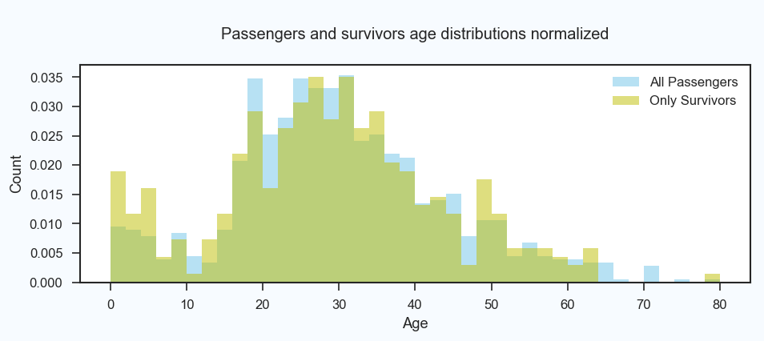

# <font color='#5493b7'><center><h1>The Titanic</h1></center></font>


```python
from IPython.display import Image
from IPython.core.display import HTML
Image(url="titanic.jpg", width=1000)
```


# <font color='#5493b7'><center><h1>Describing, questioning and analyzing a disaster</h1><br /></center></font>
## <center><h2>Udacity - Data Analyst Nanodegree Program</h2></center>
## <center><h3>Aviad Giat - June 2017</h3></center>

<a id='Top'></a>
In this document:<br />
(Titles are clickable)<br />
1. [Discovering the data](#discovering)<br />
2. [Analysing the data](#analyzing)<br />
3. [Survivors by Class](#class)<br />
4. [Survivors by Gender](#gender)<br />
5. [Survivors by Age](#age)<br />
6. [Survivors by Fare](#fare)<br />
7. [Summary](#conclusion)<br />
8. [Sources](#sources)<br />
9. [Dataframes](#dataframes)

<a id='setup'></a>
# <font color='#5493b7'><center><h1>Import Libraries, upload and wrangler the data</h1><br /></center></font>
[Top](#Top)

### Libraries to import and use in this analysis


```python
import pandas as pd
import numpy as np
import matplotlib as mpl
from matplotlib import style
import matplotlib.pyplot as plt
import plotly.plotly as py
import seaborn as sns
import random
from scipy import stats
from scipy.stats import chi2_contingency
```

### Plot the matplotlib graphics inline


```python
%matplotlib inline 
```

### Making the wrapper output look nicer when output is too long


```python
%%html
<style>.output_wrapper, .output {height:auto !important; max-height:1000px;
                                }.output_scroll {box-shadow:none !important; webkit-box-shadow:none !important;}</style>
```


<style>.output_wrapper, .output {height:auto !important; max-height:1000px;
                                }.output_scroll {box-shadow:none !important; webkit-box-shadow:none !important;}</style>


### Upload, clean, style, organize the raw data and output the first few lines of the modified Pandas dataframe


```python
# Open the Titanic dataset with Pandas
statsi = pd.read_csv('titanic-data.csv')

# Change columns' names
statsi.rename(columns={'Pclass': 'Class', 'Sex': 'Gender'}, inplace=True)   

# Change the "Fare" variable to an integer
statsi['Fare'] = statsi['Fare'].astype(int)   

# Fill the empty 'Age' column's cells with even spaced linear numbers
statsi['Age'] = statsi['Age'].interpolate()

# Create a new columns 'Sex' as an int
statsi['Sex'] = statsi['Gender'].map({'male': 0, 'female': 1})

# Narrow down the (variables) scope of this dataframe
statsi = statsi[['Survived', 'Class', 'Gender', 'Age', 'Fare', 'Sex']]

# Keep floating numbers with not more than 2 decimals
pd.set_option('display.precision', 2) 

# Make sure there are no NULLS. Change False to True to see the result.
if False:
    print('\nMake sure there are no empty sells in the dataframe\n===================================================')
    print(statsi.notnull().sum())
    

# Add column with strings (Yes, No) drawing the data from the integeer Survived column 
statsi['Survived_y_n'] = statsi['Survived'] # Create a new column 'Survived_y_n'
statsi['Survived_y_n'] = statsi['Survived_y_n'].map({0: 'No', 1:"Yes"}) # map the new column
```

### Print the new dataframe (statsi)


```python
# Print the first 5 lines of the new dataframe with Duplicated columns, 
# where 1 column represents the integer and one the string, for easier calculations.
print("The new dataframe's first rows\n==============================")
print(statsi.head())
```

    The new dataframe's first rows
    ==============================
       Survived  Class  Gender   Age  Fare  Sex Survived_y_n
    0         0      3    male  22.0     7    0           No
    1         1      1  female  38.0    71    1          Yes
    2         1      3  female  26.0     7    1          Yes
    3         1      1  female  35.0    53    1          Yes
    4         0      3    male  35.0     8    0           No
    

### Defining age ranges for the "Age" analysis further down in this document


```python
def age_range(age):
    if age < 10:
        return '01'
    elif age > 10 and age < 20:
        return '10'
    elif age > 20 and age < 30:
        return '20'
    elif age > 30 and age < 40:
        return '30'
    elif age > 40 and age < 50:
        return '40'
    elif age > 50 and age < 60:
        return '50'
    elif age > 60 and age < 70:
        return '60'
    elif age > 70:
        return '70'
    else:
        return
    return

# Add a column to the dataframe with Ages according to the above function
statsi['Ages'] = statsi['Age'].apply(age_range)
```

### Description of the variables in this analysis

Survived &nbsp; &nbsp; &nbsp; &nbsp; &nbsp; Passenger's survival as an integer (0 = No, 1 = Yes)<br />
Survived_y_n &nbsp; Passenger's survival as a string (yes, No)<br />
Class &nbsp; &nbsp; &nbsp; &nbsp; &nbsp; &nbsp; &nbsp; &nbsp;Passenger's Class (1 = 1st; 2 = 2nd; 3 = 3rd)<br />
Gender &nbsp; &nbsp; &nbsp; &nbsp; &nbsp; &nbsp; Passenger's gender (Male/Female)<br />
Sex &nbsp; &nbsp; &nbsp; &nbsp; &nbsp; &nbsp; &nbsp; &nbsp; &nbsp; Passenger's gender (0 = Male; 1 = Female)<br />
Age &nbsp; &nbsp; &nbsp; &nbsp; &nbsp; &nbsp; &nbsp; &nbsp; &nbsp; Passenger's Age<br />
Ages &nbsp; &nbsp; &nbsp; &nbsp; &nbsp; &nbsp; &nbsp; &nbsp; Passenger's Age group by decades (0-10 = 01, 10-20 = 10, ... , 70-80 = 70)<br />
Fare &nbsp; &nbsp; &nbsp; &nbsp; &nbsp; &nbsp; &nbsp; &nbsp; &nbsp;The cost of the ticket in dollars

### Add a new dataframe with only survivors


```python
# Add a new dataframe with only survivors, where Survived = 1 (Yes).
# This dataframe will be used throughout this document
survivors = statsi.copy(deep=True)
survivors = survivors.loc[survivors['Survived'] == 1]
```

[Top](#Top)<br />
[Setup](#setup)

<a id='discovering'></a>
# <font color='#5493b7'><center><h1>Discovering and describing the data</h1><br /></center></font>
[Top](#Top)

### Dataframe summary, types, NaNs and statistics


```python
# Number of columns and rows (max)
columns = str(statsi.shape[1])
rows = str(statsi.shape[0])
print('\nRows and columns\n================\nThere are ' + columns + 
      ' Columns and ' + rows + ' Rows in this dataset\n')  

# List of column names, number of records and the type of data for each record
print('\nThe types of data for this dataframe\n====================================')
print(statsi.dtypes) 

# How many total entries? What are the columns and their types
# Each column has how many not-null values?
print('\n\nMore details about the data frame\n=================================')
print(statsi.info()) 

# Statistical summary of the numeric variables
print('\n\nStatistical summary of the numeric data'
      '\n=======================================')
statsi1 = statsi.drop(['Gender', 'Sex'], axis=1) # Drop columns for relevancy
print(statsi1.describe())
```

    
    Rows and columns
    ================
    There are 8 Columns and 891 Rows in this dataset
    
    
    The types of data for this dataframe
    ====================================
    Survived          int64
    Class             int64
    Gender           object
    Age             float64
    Fare              int32
    Sex               int64
    Survived_y_n     object
    Ages             object
    dtype: object
    
    
    More details about the data frame
    =================================
    <class 'pandas.core.frame.DataFrame'>
    RangeIndex: 891 entries, 0 to 890
    Data columns (total 8 columns):
    Survived        891 non-null int64
    Class           891 non-null int64
    Gender          891 non-null object
    Age             891 non-null float64
    Fare            891 non-null int32
    Sex             891 non-null int64
    Survived_y_n    891 non-null object
    Ages            814 non-null object
    dtypes: float64(1), int32(1), int64(3), object(3)
    memory usage: 52.3+ KB
    None
    
    
    Statistical summary of the numeric data
    =======================================
           Survived   Class     Age    Fare
    count    891.00  891.00  891.00  891.00
    mean       0.38    2.31   29.73   31.79
    std        0.49    0.84   13.90   49.70
    min        0.00    1.00    0.42    0.00
    25%        0.00    2.00   21.00    7.00
    50%        0.00    3.00   28.50   14.00
    75%        1.00    3.00   38.00   31.00
    max        1.00    3.00   80.00  512.00
    

# <font color='#5493b7'><center><h1>Questions about the data</h1><br /></center></font>

* Were there more people who died or survived? What was the percent of survivors from all passengers?<br />
* Who had the best chances to survive?<br />
&nbsp; &nbsp;<span style="color:#0000FF;">Males VS Females (Gender)</span><br />
&nbsp; &nbsp;<span style="color:#008000;">Age by decades (Ages)</span><br />
&nbsp; &nbsp;<span style="color:#0000FF;">Ticket's cost (Fare)</span><br />
&nbsp; &nbsp;<span style="color:#008000;">Class - The ticket class (First, Second, Third)</span>

[Top](#Top)<br />
[Discover](#discovering)

<a id='analyzing'></a>
# <font color='#5493b7'><center><h1>Analyzing the data and answering the above questions (among others)</h1><br /></center></font>
[Top](#Top)

* Note that this project does not take into account the crew members on board and their survival statistics. The scope of this analysis is limited to the passengers only.<br />
<br />
The dependent variable is the number of survivors. I will analyze 4 independent variables against it. The variables are:&nbsp;<br />
<span style="color:#0000FF;">Class </span>| <span style="color:#008000;">Age </span>| <span style="color:#0000FF;">Gender </span>| <span style="color:#008000;">Fare</span>.<br />
<br />
I will also try to answer one of the above questions with a statistical test.<br />
<br />
Let's start with the general number of survivors and victims:

## Number of survivors


```python
# Number of survivors
print('\nNumber of survivors and victims\n===============================\n')
print(statsi['Survived_y_n'].value_counts())
print('\n')

# Plot number of survivors
sns.set_style('ticks')
plot = sns.factorplot('Survived_y_n', data = statsi, kind="count", 
                      palette="Blues", legend=True, size=4, aspect=2)
sns.plt.title('Number of passengers who survived and who did not')
```

    
    Number of survivors and victims
    ===============================
    
    No     549
    Yes    342
    Name: Survived_y_n, dtype: int64
    
    
    


    <matplotlib.text.Text at 0x136ef70b160>


## Percent of survivors


```python
# Set up the plot's figure
fig = plt.figure(facecolor='#f7fbff', edgecolor='#08306b', figsize=(400,200), dpi=120)
fig.set_figwidth(9)
fig.set_figheight(3)

# Plot the percent of survivors
pie_chart = (statsi['Survived'].value_counts()) # Create the array 'x' for the pie chart
colors = ['#55a868', '#2adbf7'] # Set the colors for the slices (2 in this case)
plt.pie(pie_chart, shadow=False, colors=colors, autopct='%1.1f%%', labels = ['Died', 'Survived'],
        wedgeprops = { 'linewidth' : 1 , 'edgecolor' : 'black'})# Plot the pie chart
plt.axis('equal')  # make the chart look good (round)
plt.title('\nPercent of Survivors\n================') # Give a title to the plot
plt.show() # Show the plot
```


* As we can see from the above pie chart, more passengers died (61%) on the Titanic than survived (38%). For every 10 people who survived 16 perished.

[Top](#Top)<br />
[Analysing](#analyzing)


Now, lets break down the numbers and percentages following the 4 variables Class | Age | Gender | Fare:

<a id='class'></a>
# <center><h1>Survivors by Class</h1></center>
[Top](#Top)

* Which class members' survival rate was the highest?


```python
# Print related numbers to the Class variable
print('\nNumber of passengers in each class\n==================================\n')
pass_count = statsi['Class'].value_counts(sort=False) # Count passengers
print(pass_count) #Print the count of the passengers

# Print the number of survivors as a crosstab
print('\n\nNumber of survivors by class\n============================\n')
# Output a pivot-like table crossing data from 2 variables
print(pd.crosstab(statsi.Class, statsi.Survived_y_n))

# Print crosstab of the percent of survivors by class
print('\n\nPercent of survivors by class\n=============================\n')
# Crossing data with percent of survivors by class
print(pd.crosstab(statsi.Class, statsi.Survived_y_n, margins=True, normalize='index')* 100) 
```

    
    Number of passengers in each class
    ==================================
    
    1    216
    2    184
    3    491
    Name: Class, dtype: int64
    
    
    Number of survivors by class
    ============================
    
    Survived_y_n   No  Yes
    Class                 
    1              80  136
    2              97   87
    3             372  119
    
    
    Percent of survivors by class
    =============================
    
    Survived_y_n     No    Yes
    Class                     
    1             37.04  62.96
    2             52.72  47.28
    3             75.76  24.24
    All           61.62  38.38
    


```python
# Plots of passengers by class

plot = sns.factorplot('Class', data = statsi, size=5, aspect=2, kind="count", palette="Blues", legend=True)
sns.plt.title('Passengers By Class (in numbers)')

plot = sns.factorplot('Class', 'Survived',data = statsi, size=5, aspect=2, ci=None, kind="bar", palette="winter_d")
sns.plt.title('Survivors by Class (in percent)')
```


    <matplotlib.text.Text at 0x136ec343ac8>


First class passengers had the highest survival rate (62%), while passengers from class 3 had less than 25% chances to survive. Passengers from class 2 had almost 50% chances to survive.
Was it a chance, and could the survival odds flip between the classes in a similar disaster like that?

H0 = The survival rate will be equal (33.3% to the passengers in each group)

Since this is a nominal type of data I will use the Chi-Square test to analyze it:


```python
# Chi-Square test to test the goodness of fit between the survival rate of the 3 classes
print('\nChi-Square Test - Number of survivors by Class\n==============================================\n\n'
     'Ho: There is no significant difference between any of the classes\' survival rate.\n'
      'Ha: There is a significant difference in the survival rate between any of the 3 classes of passengers.'
      '\nThe survival rate should be 33.3% for the 1st Class, 33.3% for the Second Class and 33.3% for the Third Class.\n')

# Contingency table of the classes' survival
print('Contingency table of the classes\' surviuval\n===========================================')
print(pd.crosstab(statsi.Class, statsi.Survived, margins=True))
print('\n')

chi_sq = pd.crosstab(statsi.Class, statsi.Survived, margins=False)
print('The Chi-Square (Goodness of fit), Probablility, Degrees Of Freedom, and the Expected frequencies\n'
     '==============================================================================')
print(chi2_contingency(chi_sq))
```

    
    Chi-Square Test - Number of survivors by Class
    ==============================================
    
    Ho: There is no significant difference between any of the classes' survival rate.
    Ha: There is a significant difference in the survival rate between any of the 3 classes of passengers.
    The survival rate should be 33.3% for the 1st Class, 33.3% for the Second Class and 33.3% for the Third Class.
    
    Contingency table of the classes' surviuval
    ===========================================
    Survived    0    1  All
    Class                  
    1          80  136  216
    2          97   87  184
    3         372  119  491
    All       549  342  891
    
    
    The Chi-Square (Goodness of fit), Probablility, Degrees Of Freedom, and the Expected frequencies
    ==============================================================================
    (102.88898875696056, 4.5492517112987927e-23, 2, array([[ 133.09090909,   82.90909091],
           [ 113.37373737,   70.62626263],
           [ 302.53535354,  188.46464646]]))
    

* We can see here that the chi-square statistic is 103 with 2 degrees of freedom. The p-value is smaller than 0.00001. The result is significant at p < 0.5.<br /><br />
* If we were to repeat the disaster the survival rates of the 3 classes will repeat themselves 95 percent of the times.

[Top](#Top)<br />
[Class](#class)

<a id='gender'></a>
# <center><h1>Survivors by Gender</h1></center>
[Top](#Top)

* Which gender had better survival rates?<br />
<br />
Let's start with counting the number of passengers on board after leaving the last port of embarkation.<br />
After that we'll find what is the percent of the survivors and the number of survivors from each gender:

### Number of Passengers


```python
# Number of passengers
print('\nNumber of males and Females on board\n================================\n')
print(statsi.Gender.value_counts())
print('\n')
print('There were 263 more males than females on board\n')
# Pie chart of the survivors and victims in percent
fig = plt.figure(facecolor='#f7fbff', edgecolor='#08306b', figsize=(400,200), dpi=120)
fig.set_figwidth(9)
fig.set_figheight(3)

pie_chart = (statsi['Survived'].value_counts())
colors = ['#d4ebf7', '#eae8ea']
plt.pie(pie_chart, shadow=False, colors=colors, autopct='%1.1f%%', labels = ['males', 'females'],
        wedgeprops = { 'linewidth' : 1 , 'edgecolor' : 'lightgrey'})
plt.axis('equal')
plt.title('\nPercent of males and females on board\n=============================')
plt.show()
```

    
    Number of males and Females on board
    ================================
    
    male      577
    female    314
    Name: Gender, dtype: int64
    
    
    There were 263 more males than females on board
    
    


### Number and percent of males and females from the survivors


```python
# Pie chart of percent of males and females on board
fig = plt.figure(facecolor='#f7fbff', edgecolor='#08306b', figsize=(400,200), dpi=120)
fig.set_figwidth(9)
fig.set_figheight(3)

sbg = statsi # Create new DF for survivors by gender
pie_chart = (sbg['Gender'].value_counts())
colors = ['#9ecae1', '#94b582']
plt.pie(pie_chart, shadow=False, colors=colors, autopct='%1.1f%%', labels = ['females', 'males'], 
        wedgeprops = { 'linewidth' : 1 , 'edgecolor' : 'black'})
plt.axis('equal') 
plt.title('\nPercent of males and females from all survivors (342)\n==========='
          '============================')
plt.show() # Number of survivors by Gender

print('\nNumber of survivors by Gender\n=============================\n')
print(pd.crosstab(statsi.Gender, survivors.Survived, margins=True))
print('\n')

```


    
    Number of survivors by Gender
    =============================
    
    Survived  1.0  All
    Gender            
    female    233  233
    male      109  109
    All       342  342
    
    
    

We can see that more females than males survived. But is it significant difference or a statistical error?
Before answering this question with a statistical test, lets take a look at the numbers and percentages of survival of both genders and within each gender:

# Male survival


```python
# Pie chart of percent of males survived
sbgm = sbg
sbgm = sbgm.loc[sbgm['Gender'] == 'male']
sbgm_chart = sbgm['Survived_y_n'].value_counts(normalize=True) * 100

fig = plt.figure(facecolor='#f7fbff', edgecolor='#08306b', figsize=(400,200), dpi=120)
fig.set_figwidth(9)
fig.set_figheight(3)

colors = ['#fce394', '#f8b735']
plt.pie(sbgm_chart, shadow=False, colors=colors, autopct='%1.1f%%', 
        labels = ['males Died', 'males Survived'], wedgeprops = { 'linewidth' : 1 , 'edgecolor' : 'black'})
plt.axis('equal') 
plt.title('\nmales survivors (109) from all males who embarked (577)\n=========================================')
plt.show()

# Percent of Male survivors
print('\nNumber of Male survivors\n========================\n')
print(pd.crosstab(sbgm.Gender, sbgm.Survived_y_n, margins=True))
print('\n')
```


    
    Number of Male survivors
    ========================
    
    Survived_y_n   No  Yes  All
    Gender                     
    male          468  109  577
    All           468  109  577
    
    
    

# Female survival


```python
# Pie chart of percent of females survived
sbgf = sbg
sbgf = sbgf.loc[sbgf['Gender'] == 'female']
sbgf_chart = sbgf['Survived_y_n'].value_counts(normalize=True) * 100

fig = plt.figure(facecolor='#f7fbff', edgecolor='#08306b', figsize=(400,200), dpi=120)
fig.set_figwidth(9)
fig.set_figheight(3)

colors = ['#6baed6', '#deebf7']
plt.pie(sbgf_chart, shadow=False, colors=colors, autopct='%1.1f%%', 
        labels = ['Female Survived', 'females Died'], wedgeprops = { 'linewidth' : 1 , 'edgecolor' : 'black'})
plt.axis('equal') 
plt.title('\nFemale survivors (233) from all females who embarked (314)\n==============================================')
plt.show()

# Percent of Male survivors
print('\nNumber of Female survivors\n========================\n')
print(pd.crosstab(sbgf.Gender, sbgf.Survived_y_n, margins=True))
```


    
    Number of Female survivors
    ========================
    
    Survived_y_n  No  Yes  All
    Gender                    
    female        81  233  314
    All           81  233  314
    

* 75% of the females who embarked on the first and last trip of the Titanic survived, compare to only 19% of the males.&nbsp;<br />
This means that females had 4 times better chance to survive on this cruise.<br />
<br />
When the Titanic left the last harbor, there were 577 males on the ship (out of 891 passengers), almost twice the number of females (314). Yet, 68% of the total survivors were females (233).<br />
<br />
Now, lets check with a statistical test if the difference between the two genders' survival rate is significantly different and is not due to chance.<br />
<br />
I will us the chi-Square test here as well:


```python
# Chi-Square test to test the goodness of fit between males and females who survived
print('\nChi-Square Test - Number of survivors by Gender\n=============================\n\n'
     'Ho: There is no significant difference between males and females\'s survival rate.\n'
     'Ha: There is a significant difference between males and females\'s survival rate'
      '\nThe survival rate should be 50% males and 50% females.\n')

# Contingency table of males and females survival
print('Contingency table of males and females survival\n===========================================')
print(pd.crosstab(statsi.Gender, statsi.Survived, margins=True))
print('\n')

chi_s = pd.crosstab(statsi.Gender, statsi.Survived, margins=False)
print('The Chi-Square (Goodness of fit), Probablility, Degrees Of Freedom, and the Expected frequencies\n'
     '==============================================================================')
print(chi2_contingency(chi_s))
```

    
    Chi-Square Test - Number of survivors by Gender
    =============================
    
    Ho: There is no significant difference between males and females's survival rate.
    Ha: There is a significant difference between males and females's survival rate
    The survival rate should be 50% males and 50% females.
    
    Contingency table of males and females survival
    ===========================================
    Survived    0    1  All
    Gender                 
    female     81  233  314
    male      468  109  577
    All       549  342  891
    
    
    The Chi-Square (Goodness of fit), Probablility, Degrees Of Freedom, and the Expected frequencies
    ==============================================================================
    (260.71702016732104, 1.1973570627755645e-58, 1, array([[ 193.47474747,  120.52525253],
           [ 355.52525253,  221.47474747]]))
    

The Chi square result is 260 with 1 degree of freedom.<br />
<br />
The one-tailed P value is less than 0.0001.<br />
The association between males, females, and survival is considered to be extremely statistically significant.<br />
In other words, females did not survive in such a great proportion by chance. There had to be a cultural code of behavior that says, females first.

[Top](#Top)<br />
[Gender](#gender)

<a id='age'></a>
# <center><h1>Survivors by Age</h1></center>
[Top](#Top)

* Which group age had the best chances of survival?


```python
# Plot histograms of the distribution of passengers compare to the distribution of survivors

fig = plt.figure(facecolor='#f7fbff', edgecolor='#08306b', figsize=(400,300), dpi=120)
fig.set_figwidth(9)
fig.set_figheight(3)

plt.hist(statsi['Age'], bins = 40, range = (0, 80), alpha = 0.6, label='All Passengers', color = "skyblue")
plt.hist(survivors['Age'], bins = 40, range = (0, 80), alpha = 0.5, color = "y", label='Only Survivors')

plt.xlabel("Age")
plt.ylabel("Count")
plt.legend()
plt.title('\nAge distribution in years\n==================')
plt.show()
```


```python
# Plot histograms of the normalized distributions for the 2 columns above
fig = plt.figure(facecolor='#f7fbff', edgecolor='#08306b', figsize=(400,300), dpi=120)
fig.set_figwidth(9)
fig.set_figheight(3)

plt.hist(statsi['Age'], normed=1, bins = 40, range = (0, 80), alpha = 0.6, label='All Passengers', color = "skyblue")
plt.hist(survivors['Age'], normed=1, bins = 40, range = (0, 80), alpha = 0.5, color = "y", label='Only Survivors')

plt.xlabel("Age")
plt.ylabel("Count")
plt.legend()
plt.title('\nPassengers and survivors'' age distributions normalized\n')
plt.show()
```





* We can see from the above plots that passengers and survivors distributions have more or less the same shape, in both plots. In the 'Age distribution in years' plot above we can also see that there is a wide gap between the number of passengers and the number of survivors. This seems like that there were more people who died than survived in most ages.<br />
Let’s try to digg in and see if this is really the case or not using the function (age_range) from the top of this document.

# Survivors by age (plot)


```python
from matplotlib import cm # Colormap for the pie chart

# Passengers by age group in percent pie chart
percent_sur = pd.crosstab(survivors.Ages, survivors.Survived, normalize=True)*100

fig = plt.figure(facecolor='#f7fbff', edgecolor='#08306b', figsize=(400,300), dpi=120)
fig.set_figwidth(9)
fig.set_figheight(3)

labels = ['01s', '10s', '20s','30s', '40s','50s', '60s','70s']
cs=cm.Set1(np.arange(8)/8.)
plt.pie(percent_sur, shadow=False, colors=cs, autopct='%1.1f%%', 
        labels = labels, wedgeprops = { 'linewidth' : 1 , 'edgecolor' : 'gray'},
       explode = (0, 0, 0, 0, 0, 0.1, 0.6, 1.4))
plt.axis('equal') 
plt.title('\nSurvivors by age group in percent\n==========================')

plt.show()
```


* After dividing the Age variable into gaps of 10 years, we can see that the group ages of the 20's and 30's survival rate is the highest. These two group ages also had the highest number of passengers. The same thing goes to the other age groups in respect to their portion of the entire population.<br />
<br />
Next, I will break down the numbers of passengers and survivors by age groups and compare the percent of survivors from each group to the total number of passengers in the specific group. In that way, it will be easy to find out the group/s with the highest\lowest rate of survival.

# Age groups numbers and percents from the entire population


```python
# Passengers by age group in numbers
print('\nPassengers by age group in numbers\n==================================\n')
print(statsi.Ages.value_counts())

# Passengers by age group in percent
print('\nPercent of each age group from the entire population\n====================================================')
passengers = pd.crosstab(statsi.Ages, statsi.Survived_y_n, normalize=True, margins=True)*100
Group_percent = (passengers['All'])
print(Group_percent)
```

    
    Passengers by age group in numbers
    ==================================
    
    20    260
    30    199
    10    127
    40     96
    01     69
    50     42
    60     16
    70      5
    Name: Ages, dtype: int64
    
    Percent of each age group from the entire population
    ====================================================
    Ages
    01       8.48
    10      15.60
    20      31.94
    30      24.45
    40      11.79
    50       5.16
    60       1.97
    70       0.61
    All    100.00
    Name: All, dtype: float64
    

# Age groups numbers and percent from the survivors only


```python
# Percent and Number of survivors by age group
print('\nPercent of survivors by age group\n=================================')
percent_sur = pd.crosstab(survivors.Ages, survivors.Survived, normalize=True)*100
print(percent_sur)

print('\nNumber of survivors by age group\n================================')
print(pd.crosstab(survivors.Ages, survivors.Survived_y_n))
```

    
    Percent of survivors by age group
    =================================
    Survived      1
    Ages           
    01        12.70
    10        15.56
    20        28.57
    30        25.08
    40        11.11
    50         5.40
    60         1.27
    70         0.32
    
    Number of survivors by age group
    ================================
    Survived_y_n  Yes
    Ages             
    01             40
    10             49
    20             90
    30             79
    40             35
    50             17
    60              4
    70              1
    

* Looking closer at the data we can see that some age groups were almost completely wiped out, like people older than 70 years old. This group that had 5 members lost 4! The 60s group lost 3/4 of its members. From 16 only 4 survived.
Below is another table with the number of survivors from within each group:

# Survival within each group age


```python
# What is the number of survival from within each group age?
group_ages_surv = statsi
group_ages_surv = group_ages_surv[['Survived', 'Ages', 'Gender']]
group_ages_surv = pd.crosstab(group_ages_surv.Ages, group_ages_surv.Survived,  margins=True)
print('\nNumber of survivors from each group age\n=======================================')

def highlight_vals(val, color='Yellow'): # Highlight sells in the table
    if val > 0:
        return 'background-color: %s' % color
    else:
        return 'None'

group_ages_surv.style.applymap(highlight_vals, subset=[1])
```

    
    Number of survivors from each group age
    =======================================
    


<style  type="text/css" >
    #T_ae1c5336_4ff2_11e7_a59a_00051bd03e08row0_col1 {
            background-color:  Yellow;
        }    #T_ae1c5336_4ff2_11e7_a59a_00051bd03e08row1_col1 {
            background-color:  Yellow;
        }    #T_ae1c5336_4ff2_11e7_a59a_00051bd03e08row2_col1 {
            background-color:  Yellow;
        }    #T_ae1c5336_4ff2_11e7_a59a_00051bd03e08row3_col1 {
            background-color:  Yellow;
        }    #T_ae1c5336_4ff2_11e7_a59a_00051bd03e08row4_col1 {
            background-color:  Yellow;
        }    #T_ae1c5336_4ff2_11e7_a59a_00051bd03e08row5_col1 {
            background-color:  Yellow;
        }    #T_ae1c5336_4ff2_11e7_a59a_00051bd03e08row6_col1 {
            background-color:  Yellow;
        }    #T_ae1c5336_4ff2_11e7_a59a_00051bd03e08row7_col1 {
            background-color:  Yellow;
        }    #T_ae1c5336_4ff2_11e7_a59a_00051bd03e08row8_col1 {
            background-color:  Yellow;
        }</style>  
<table id="T_ae1c5336_4ff2_11e7_a59a_00051bd03e08" > 
<thead>    <tr> 
        <th class="index_name level0" >Survived</th> 
        <th class="col_heading level0 col0" >0</th> 
        <th class="col_heading level0 col1" >1</th> 
        <th class="col_heading level0 col2" >All</th> 
    </tr>    <tr> 
        <th class="index_name level0" >Ages</th> 
        <th class="blank" ></th> 
        <th class="blank" ></th> 
        <th class="blank" ></th> 
    </tr></thead> 
<tbody>    <tr> 
        <th id="T_ae1c5336_4ff2_11e7_a59a_00051bd03e08" class="row_heading level0 row0" >01</th> 
        <td id="T_ae1c5336_4ff2_11e7_a59a_00051bd03e08row0_col0" class="data row0 col0" >29</td> 
        <td id="T_ae1c5336_4ff2_11e7_a59a_00051bd03e08row0_col1" class="data row0 col1" >40</td> 
        <td id="T_ae1c5336_4ff2_11e7_a59a_00051bd03e08row0_col2" class="data row0 col2" >69</td> 
    </tr>    <tr> 
        <th id="T_ae1c5336_4ff2_11e7_a59a_00051bd03e08" class="row_heading level0 row1" >10</th> 
        <td id="T_ae1c5336_4ff2_11e7_a59a_00051bd03e08row1_col0" class="data row1 col0" >78</td> 
        <td id="T_ae1c5336_4ff2_11e7_a59a_00051bd03e08row1_col1" class="data row1 col1" >49</td> 
        <td id="T_ae1c5336_4ff2_11e7_a59a_00051bd03e08row1_col2" class="data row1 col2" >127</td> 
    </tr>    <tr> 
        <th id="T_ae1c5336_4ff2_11e7_a59a_00051bd03e08" class="row_heading level0 row2" >20</th> 
        <td id="T_ae1c5336_4ff2_11e7_a59a_00051bd03e08row2_col0" class="data row2 col0" >170</td> 
        <td id="T_ae1c5336_4ff2_11e7_a59a_00051bd03e08row2_col1" class="data row2 col1" >90</td> 
        <td id="T_ae1c5336_4ff2_11e7_a59a_00051bd03e08row2_col2" class="data row2 col2" >260</td> 
    </tr>    <tr> 
        <th id="T_ae1c5336_4ff2_11e7_a59a_00051bd03e08" class="row_heading level0 row3" >30</th> 
        <td id="T_ae1c5336_4ff2_11e7_a59a_00051bd03e08row3_col0" class="data row3 col0" >120</td> 
        <td id="T_ae1c5336_4ff2_11e7_a59a_00051bd03e08row3_col1" class="data row3 col1" >79</td> 
        <td id="T_ae1c5336_4ff2_11e7_a59a_00051bd03e08row3_col2" class="data row3 col2" >199</td> 
    </tr>    <tr> 
        <th id="T_ae1c5336_4ff2_11e7_a59a_00051bd03e08" class="row_heading level0 row4" >40</th> 
        <td id="T_ae1c5336_4ff2_11e7_a59a_00051bd03e08row4_col0" class="data row4 col0" >61</td> 
        <td id="T_ae1c5336_4ff2_11e7_a59a_00051bd03e08row4_col1" class="data row4 col1" >35</td> 
        <td id="T_ae1c5336_4ff2_11e7_a59a_00051bd03e08row4_col2" class="data row4 col2" >96</td> 
    </tr>    <tr> 
        <th id="T_ae1c5336_4ff2_11e7_a59a_00051bd03e08" class="row_heading level0 row5" >50</th> 
        <td id="T_ae1c5336_4ff2_11e7_a59a_00051bd03e08row5_col0" class="data row5 col0" >25</td> 
        <td id="T_ae1c5336_4ff2_11e7_a59a_00051bd03e08row5_col1" class="data row5 col1" >17</td> 
        <td id="T_ae1c5336_4ff2_11e7_a59a_00051bd03e08row5_col2" class="data row5 col2" >42</td> 
    </tr>    <tr> 
        <th id="T_ae1c5336_4ff2_11e7_a59a_00051bd03e08" class="row_heading level0 row6" >60</th> 
        <td id="T_ae1c5336_4ff2_11e7_a59a_00051bd03e08row6_col0" class="data row6 col0" >12</td> 
        <td id="T_ae1c5336_4ff2_11e7_a59a_00051bd03e08row6_col1" class="data row6 col1" >4</td> 
        <td id="T_ae1c5336_4ff2_11e7_a59a_00051bd03e08row6_col2" class="data row6 col2" >16</td> 
    </tr>    <tr> 
        <th id="T_ae1c5336_4ff2_11e7_a59a_00051bd03e08" class="row_heading level0 row7" >70</th> 
        <td id="T_ae1c5336_4ff2_11e7_a59a_00051bd03e08row7_col0" class="data row7 col0" >4</td> 
        <td id="T_ae1c5336_4ff2_11e7_a59a_00051bd03e08row7_col1" class="data row7 col1" >1</td> 
        <td id="T_ae1c5336_4ff2_11e7_a59a_00051bd03e08row7_col2" class="data row7 col2" >5</td> 
    </tr>    <tr> 
        <th id="T_ae1c5336_4ff2_11e7_a59a_00051bd03e08" class="row_heading level0 row8" >All</th> 
        <td id="T_ae1c5336_4ff2_11e7_a59a_00051bd03e08row8_col0" class="data row8 col0" >499</td> 
        <td id="T_ae1c5336_4ff2_11e7_a59a_00051bd03e08row8_col1" class="data row8 col1" >315</td> 
        <td id="T_ae1c5336_4ff2_11e7_a59a_00051bd03e08row8_col2" class="data row8 col2" >814</td> 
    </tr></tbody> 
</table> 


* The largest age groups of survivors are the 20s and the 30s. This is merely because they constituted the biggest group in the age distribution of all passengers. But being the group that had the highest number of survivors does not mean that their chances were better than other age groups' members. Below are two ways to demonstrate that. A table with the groups and their survival rate and a bar plot with the same information:


```python
# What is the percent of survival from within each group age?

print('\nPercent of survivors from within each group age\n===============================================')

def highlight_vals(val, color='Yellow'): # Highlight sells in the table
    if val > 0:
        return 'background-color: %s' % color
    else:
        return 'None'
group_ages_per = group_ages_surv
group_ages_per['Percent'] = group_ages_per[1]*100/group_ages_per['All']
group_ages_per['Age Group'] = group_ages_per.index
group_ages_per['Percent'].sort_values(ascending=False)
group_ages_per.style.applymap(highlight_vals, subset=['Percent'])
```

    
    Percent of survivors from within each group age
    ===============================================
    


<style  type="text/css" >
    #T_b40044b4_4ff2_11e7_b2d4_00051bd03e08row0_col3 {
            background-color:  Yellow;
        }    #T_b40044b4_4ff2_11e7_b2d4_00051bd03e08row1_col3 {
            background-color:  Yellow;
        }    #T_b40044b4_4ff2_11e7_b2d4_00051bd03e08row2_col3 {
            background-color:  Yellow;
        }    #T_b40044b4_4ff2_11e7_b2d4_00051bd03e08row3_col3 {
            background-color:  Yellow;
        }    #T_b40044b4_4ff2_11e7_b2d4_00051bd03e08row4_col3 {
            background-color:  Yellow;
        }    #T_b40044b4_4ff2_11e7_b2d4_00051bd03e08row5_col3 {
            background-color:  Yellow;
        }    #T_b40044b4_4ff2_11e7_b2d4_00051bd03e08row6_col3 {
            background-color:  Yellow;
        }    #T_b40044b4_4ff2_11e7_b2d4_00051bd03e08row7_col3 {
            background-color:  Yellow;
        }    #T_b40044b4_4ff2_11e7_b2d4_00051bd03e08row8_col3 {
            background-color:  Yellow;
        }</style>  
<table id="T_b40044b4_4ff2_11e7_b2d4_00051bd03e08" > 
<thead>    <tr> 
        <th class="index_name level0" >Survived</th> 
        <th class="col_heading level0 col0" >0</th> 
        <th class="col_heading level0 col1" >1</th> 
        <th class="col_heading level0 col2" >All</th> 
        <th class="col_heading level0 col3" >Percent</th> 
        <th class="col_heading level0 col4" >Age Group</th> 
    </tr>    <tr> 
        <th class="index_name level0" >Ages</th> 
        <th class="blank" ></th> 
        <th class="blank" ></th> 
        <th class="blank" ></th> 
        <th class="blank" ></th> 
        <th class="blank" ></th> 
    </tr></thead> 
<tbody>    <tr> 
        <th id="T_b40044b4_4ff2_11e7_b2d4_00051bd03e08" class="row_heading level0 row0" >01</th> 
        <td id="T_b40044b4_4ff2_11e7_b2d4_00051bd03e08row0_col0" class="data row0 col0" >29</td> 
        <td id="T_b40044b4_4ff2_11e7_b2d4_00051bd03e08row0_col1" class="data row0 col1" >40</td> 
        <td id="T_b40044b4_4ff2_11e7_b2d4_00051bd03e08row0_col2" class="data row0 col2" >69</td> 
        <td id="T_b40044b4_4ff2_11e7_b2d4_00051bd03e08row0_col3" class="data row0 col3" >58</td> 
        <td id="T_b40044b4_4ff2_11e7_b2d4_00051bd03e08row0_col4" class="data row0 col4" >01</td> 
    </tr>    <tr> 
        <th id="T_b40044b4_4ff2_11e7_b2d4_00051bd03e08" class="row_heading level0 row1" >10</th> 
        <td id="T_b40044b4_4ff2_11e7_b2d4_00051bd03e08row1_col0" class="data row1 col0" >78</td> 
        <td id="T_b40044b4_4ff2_11e7_b2d4_00051bd03e08row1_col1" class="data row1 col1" >49</td> 
        <td id="T_b40044b4_4ff2_11e7_b2d4_00051bd03e08row1_col2" class="data row1 col2" >127</td> 
        <td id="T_b40044b4_4ff2_11e7_b2d4_00051bd03e08row1_col3" class="data row1 col3" >39</td> 
        <td id="T_b40044b4_4ff2_11e7_b2d4_00051bd03e08row1_col4" class="data row1 col4" >10</td> 
    </tr>    <tr> 
        <th id="T_b40044b4_4ff2_11e7_b2d4_00051bd03e08" class="row_heading level0 row2" >20</th> 
        <td id="T_b40044b4_4ff2_11e7_b2d4_00051bd03e08row2_col0" class="data row2 col0" >170</td> 
        <td id="T_b40044b4_4ff2_11e7_b2d4_00051bd03e08row2_col1" class="data row2 col1" >90</td> 
        <td id="T_b40044b4_4ff2_11e7_b2d4_00051bd03e08row2_col2" class="data row2 col2" >260</td> 
        <td id="T_b40044b4_4ff2_11e7_b2d4_00051bd03e08row2_col3" class="data row2 col3" >35</td> 
        <td id="T_b40044b4_4ff2_11e7_b2d4_00051bd03e08row2_col4" class="data row2 col4" >20</td> 
    </tr>    <tr> 
        <th id="T_b40044b4_4ff2_11e7_b2d4_00051bd03e08" class="row_heading level0 row3" >30</th> 
        <td id="T_b40044b4_4ff2_11e7_b2d4_00051bd03e08row3_col0" class="data row3 col0" >120</td> 
        <td id="T_b40044b4_4ff2_11e7_b2d4_00051bd03e08row3_col1" class="data row3 col1" >79</td> 
        <td id="T_b40044b4_4ff2_11e7_b2d4_00051bd03e08row3_col2" class="data row3 col2" >199</td> 
        <td id="T_b40044b4_4ff2_11e7_b2d4_00051bd03e08row3_col3" class="data row3 col3" >40</td> 
        <td id="T_b40044b4_4ff2_11e7_b2d4_00051bd03e08row3_col4" class="data row3 col4" >30</td> 
    </tr>    <tr> 
        <th id="T_b40044b4_4ff2_11e7_b2d4_00051bd03e08" class="row_heading level0 row4" >40</th> 
        <td id="T_b40044b4_4ff2_11e7_b2d4_00051bd03e08row4_col0" class="data row4 col0" >61</td> 
        <td id="T_b40044b4_4ff2_11e7_b2d4_00051bd03e08row4_col1" class="data row4 col1" >35</td> 
        <td id="T_b40044b4_4ff2_11e7_b2d4_00051bd03e08row4_col2" class="data row4 col2" >96</td> 
        <td id="T_b40044b4_4ff2_11e7_b2d4_00051bd03e08row4_col3" class="data row4 col3" >36</td> 
        <td id="T_b40044b4_4ff2_11e7_b2d4_00051bd03e08row4_col4" class="data row4 col4" >40</td> 
    </tr>    <tr> 
        <th id="T_b40044b4_4ff2_11e7_b2d4_00051bd03e08" class="row_heading level0 row5" >50</th> 
        <td id="T_b40044b4_4ff2_11e7_b2d4_00051bd03e08row5_col0" class="data row5 col0" >25</td> 
        <td id="T_b40044b4_4ff2_11e7_b2d4_00051bd03e08row5_col1" class="data row5 col1" >17</td> 
        <td id="T_b40044b4_4ff2_11e7_b2d4_00051bd03e08row5_col2" class="data row5 col2" >42</td> 
        <td id="T_b40044b4_4ff2_11e7_b2d4_00051bd03e08row5_col3" class="data row5 col3" >40</td> 
        <td id="T_b40044b4_4ff2_11e7_b2d4_00051bd03e08row5_col4" class="data row5 col4" >50</td> 
    </tr>    <tr> 
        <th id="T_b40044b4_4ff2_11e7_b2d4_00051bd03e08" class="row_heading level0 row6" >60</th> 
        <td id="T_b40044b4_4ff2_11e7_b2d4_00051bd03e08row6_col0" class="data row6 col0" >12</td> 
        <td id="T_b40044b4_4ff2_11e7_b2d4_00051bd03e08row6_col1" class="data row6 col1" >4</td> 
        <td id="T_b40044b4_4ff2_11e7_b2d4_00051bd03e08row6_col2" class="data row6 col2" >16</td> 
        <td id="T_b40044b4_4ff2_11e7_b2d4_00051bd03e08row6_col3" class="data row6 col3" >25</td> 
        <td id="T_b40044b4_4ff2_11e7_b2d4_00051bd03e08row6_col4" class="data row6 col4" >60</td> 
    </tr>    <tr> 
        <th id="T_b40044b4_4ff2_11e7_b2d4_00051bd03e08" class="row_heading level0 row7" >70</th> 
        <td id="T_b40044b4_4ff2_11e7_b2d4_00051bd03e08row7_col0" class="data row7 col0" >4</td> 
        <td id="T_b40044b4_4ff2_11e7_b2d4_00051bd03e08row7_col1" class="data row7 col1" >1</td> 
        <td id="T_b40044b4_4ff2_11e7_b2d4_00051bd03e08row7_col2" class="data row7 col2" >5</td> 
        <td id="T_b40044b4_4ff2_11e7_b2d4_00051bd03e08row7_col3" class="data row7 col3" >20</td> 
        <td id="T_b40044b4_4ff2_11e7_b2d4_00051bd03e08row7_col4" class="data row7 col4" >70</td> 
    </tr>    <tr> 
        <th id="T_b40044b4_4ff2_11e7_b2d4_00051bd03e08" class="row_heading level0 row8" >All</th> 
        <td id="T_b40044b4_4ff2_11e7_b2d4_00051bd03e08row8_col0" class="data row8 col0" >499</td> 
        <td id="T_b40044b4_4ff2_11e7_b2d4_00051bd03e08row8_col1" class="data row8 col1" >315</td> 
        <td id="T_b40044b4_4ff2_11e7_b2d4_00051bd03e08row8_col2" class="data row8 col2" >814</td> 
        <td id="T_b40044b4_4ff2_11e7_b2d4_00051bd03e08row8_col3" class="data row8 col3" >39</td> 
        <td id="T_b40044b4_4ff2_11e7_b2d4_00051bd03e08row8_col4" class="data row8 col4" >All</td> 
    </tr></tbody> 
</table> 


```python
# Percent of survivors from each group age
print('\nPercent of survivors from within each group age:')

sns.factorplot(x='Age Group', y='Percent', data=group_ages_per, size=3, aspect=4
               , kind='bar')
sns.plt.title('Percent of survivors by group age')
```

    
    Percent of survivors from within each group age:
    


    <matplotlib.text.Text at 0x136eca3a710>


* From the above bar plot and crosstab table we can see that 58% of children under 10 years old survived and thus make it the age group with the best survival rate.&nbsp;<br />
<br />
We can also see on the other side of the plot that passengers in their 60s and 70s had less than half survival rate than the rate of children under 10. This answers the cultural code - children first.<br />
The rest of the age groups are close to the average survival rate, which was 39%.<br />
<br />
Now, let’s try to see if there was a difference in gender survival in the 1-10 years old’s children:


```python
group_ages_per_gen = statsi
group_ages_per_gen = group_ages_per_gen.loc[group_ages_per_gen['Survived'] == 1]
group_ages_per_gen = group_ages_per_gen[['Survived', 'Ages', 'Gender']]
group_ages_per_gen = pd.crosstab(group_ages_per_gen.Ages, group_ages_per_gen.Gender,  margins=True)
group_ages_per_gen[0:1]
```


<div>
<style>
    .dataframe thead tr:only-child th {
        text-align: right;
    }

    .dataframe thead th {
        text-align: left;
    }

    .dataframe tbody tr th {
        vertical-align: top;
    }
</style>
<table border="1" class="dataframe">
  <thead>
    <tr style="text-align: right;">
      <th>Gender</th>
      <th>female</th>
      <th>male</th>
      <th>All</th>
    </tr>
    <tr>
      <th>Ages</th>
      <th></th>
      <th></th>
      <th></th>
    </tr>
  </thead>
  <tbody>
    <tr>
      <th>01</th>
      <td>20</td>
      <td>20</td>
      <td>40</td>
    </tr>
  </tbody>
</table>
</div>


* As the table above indicates, both girls and boys 0-10 years old had the same survival rate.

[Top](#Top)<br />
[Age](#age)


<a id='fare'></a>
# <center><h1>Survivors by Fare</h1></center>
[Top](#Top)

### First, checking the distribution of all the tickets that were sold:


```python
fig = plt.figure(facecolor='#f7fbff', edgecolor='#08306b', figsize=(400,200), dpi=120)
fig.set_figwidth(9)
fig.set_figheight(2)

statsi['Fare'].plot(kind='density', legend=True)
```


    <matplotlib.axes._subplots.AxesSubplot at 0x136ec743f60>


From the above plot, we see that most of the passengers paid anywhere between 0 and ~$50 for a ticket. Also, we can see bumps in the $200s and $500s ticket prices. Let's take a closer look at those numbers:


```python
# Ticket(Fare) column basic statistics
print(statsi['Fare'].describe())
```

    count    891.00
    mean      31.79
    std       49.70
    min        0.00
    25%        7.00
    50%       14.00
    75%       31.00
    max      512.00
    Name: Fare, dtype: float64
    

It seems that there is a huge difference between the max and the average prices of tickets. The standard deviation is bigger than the mean. There must be outliers, let's check if we can find them with a boxplot:

# Outliers who paid more than $149 for their ticket


```python
# Boxplot with outliers
data = statsi['Fare']

fig = plt.figure(facecolor='#f7fbff', edgecolor='#08306b', figsize=(400,200), dpi=120)
fig.set_figwidth(9)
fig.set_figheight(2)

plt.boxplot(data, 0, 'gD', showmeans=True, vert=False)
plt.title('Ticket Prices Outliers')
plt.show()
```


Most of the x axis above (showing the distribution of the ticket prices) is populated by outliers (in green). 
Next is a table with only the records of passengers who paid more than $149, which are the outliers.


```python
# Who are the outliers?
# Keep only the ones that are within +3 standard deviations in the Fare column
# Any price higher than $149 (+3 standard deviations) is considered an outlier


print('\nOutliers - Ticket price and the number of people who purchases in this price\n============================================================================')
outliers = statsi # Create a new dataframe only for outliers
outliers['Fare'] = outliers['Fare'].astype(int) # Change teh Fare column to integer
outliers = outliers[outliers['Fare'] >= outliers['Fare'].std()*3] # Include in the dataframe only passengers who
outliers['Fare'].count() # Number of outliers is 29 out of 891 passengers
print(outliers['Fare'].value_counts().sort_values())

print('\nSurvival rate for the outliers\n==============================')
print(outliers['Survived_y_n'].value_counts(normalize=True) )

print('\nNumber of Outliers who survived\n===============================')
print(outliers['Survived_y_n'].value_counts() )
```

    
    Outliers - Ticket price and the number of people who purchases in this price
    ============================================================================
    221    1
    247    2
    262    2
    164    2
    153    3
    512    3
    211    4
    263    4
    227    4
    151    4
    Name: Fare, dtype: int64
    
    Survival rate for the outliers
    ==============================
    Yes    0.69
    No     0.31
    Name: Survived_y_n, dtype: float64
    
    Number of Outliers who survived
    ===============================
    Yes    20
    No      9
    Name: Survived_y_n, dtype: int64
    

Breaking down the numbers in the Fare variable, 69 percent of the passengers who paid more than 149 dollars for their ticket survived! In numbers, it is 20 passengers who survived and 9 who did not.<br />
<br />
Also, the group that stands out most is the 512 dollars one: 3 passengers paid this sum of money, which is 128 times more expensive than the lowest price ticket ($4) and 16 times more than the median price.<br />
<br />
Did those 3 passengers survive?


```python
# 3 Top Outliers survivors
def highlight_vals(val, color='Yellow'): # Highlight sells in the table
    if val == 1:
        return 'background-color: %s' % color
    else:
        return ''

# Create and print a new DF with only the passengers who paid $512
print('Top 3 most expensive ticket holders survival:')
top_outliers = outliers
top_outliers = top_outliers[top_outliers['Fare'] == 512]
top_outliers.style.applymap(highlight_vals, subset=['Survived'])
```

    Top 3 most expensive ticket holders survival:
    


<style  type="text/css" >
    #T_2ce907ae_4ff3_11e7_a621_00051bd03e08row0_col0 {
            background-color:  Yellow;
        }    #T_2ce907ae_4ff3_11e7_a621_00051bd03e08row1_col0 {
            background-color:  Yellow;
        }    #T_2ce907ae_4ff3_11e7_a621_00051bd03e08row2_col0 {
            background-color:  Yellow;
        }</style>  
<table id="T_2ce907ae_4ff3_11e7_a621_00051bd03e08" > 
<thead>    <tr> 
        <th class="blank level0" ></th> 
        <th class="col_heading level0 col0" >Survived</th> 
        <th class="col_heading level0 col1" >Class</th> 
        <th class="col_heading level0 col2" >Gender</th> 
        <th class="col_heading level0 col3" >Age</th> 
        <th class="col_heading level0 col4" >Fare</th> 
        <th class="col_heading level0 col5" >Sex</th> 
        <th class="col_heading level0 col6" >Survived_y_n</th> 
        <th class="col_heading level0 col7" >Ages</th> 
    </tr></thead> 
<tbody>    <tr> 
        <th id="T_2ce907ae_4ff3_11e7_a621_00051bd03e08" class="row_heading level0 row0" >258</th> 
        <td id="T_2ce907ae_4ff3_11e7_a621_00051bd03e08row0_col0" class="data row0 col0" >1</td> 
        <td id="T_2ce907ae_4ff3_11e7_a621_00051bd03e08row0_col1" class="data row0 col1" >1</td> 
        <td id="T_2ce907ae_4ff3_11e7_a621_00051bd03e08row0_col2" class="data row0 col2" >female</td> 
        <td id="T_2ce907ae_4ff3_11e7_a621_00051bd03e08row0_col3" class="data row0 col3" >35</td> 
        <td id="T_2ce907ae_4ff3_11e7_a621_00051bd03e08row0_col4" class="data row0 col4" >512</td> 
        <td id="T_2ce907ae_4ff3_11e7_a621_00051bd03e08row0_col5" class="data row0 col5" >1</td> 
        <td id="T_2ce907ae_4ff3_11e7_a621_00051bd03e08row0_col6" class="data row0 col6" >Yes</td> 
        <td id="T_2ce907ae_4ff3_11e7_a621_00051bd03e08row0_col7" class="data row0 col7" >30</td> 
    </tr>    <tr> 
        <th id="T_2ce907ae_4ff3_11e7_a621_00051bd03e08" class="row_heading level0 row1" >679</th> 
        <td id="T_2ce907ae_4ff3_11e7_a621_00051bd03e08row1_col0" class="data row1 col0" >1</td> 
        <td id="T_2ce907ae_4ff3_11e7_a621_00051bd03e08row1_col1" class="data row1 col1" >1</td> 
        <td id="T_2ce907ae_4ff3_11e7_a621_00051bd03e08row1_col2" class="data row1 col2" >male</td> 
        <td id="T_2ce907ae_4ff3_11e7_a621_00051bd03e08row1_col3" class="data row1 col3" >36</td> 
        <td id="T_2ce907ae_4ff3_11e7_a621_00051bd03e08row1_col4" class="data row1 col4" >512</td> 
        <td id="T_2ce907ae_4ff3_11e7_a621_00051bd03e08row1_col5" class="data row1 col5" >0</td> 
        <td id="T_2ce907ae_4ff3_11e7_a621_00051bd03e08row1_col6" class="data row1 col6" >Yes</td> 
        <td id="T_2ce907ae_4ff3_11e7_a621_00051bd03e08row1_col7" class="data row1 col7" >30</td> 
    </tr>    <tr> 
        <th id="T_2ce907ae_4ff3_11e7_a621_00051bd03e08" class="row_heading level0 row2" >737</th> 
        <td id="T_2ce907ae_4ff3_11e7_a621_00051bd03e08row2_col0" class="data row2 col0" >1</td> 
        <td id="T_2ce907ae_4ff3_11e7_a621_00051bd03e08row2_col1" class="data row2 col1" >1</td> 
        <td id="T_2ce907ae_4ff3_11e7_a621_00051bd03e08row2_col2" class="data row2 col2" >male</td> 
        <td id="T_2ce907ae_4ff3_11e7_a621_00051bd03e08row2_col3" class="data row2 col3" >35</td> 
        <td id="T_2ce907ae_4ff3_11e7_a621_00051bd03e08row2_col4" class="data row2 col4" >512</td> 
        <td id="T_2ce907ae_4ff3_11e7_a621_00051bd03e08row2_col5" class="data row2 col5" >0</td> 
        <td id="T_2ce907ae_4ff3_11e7_a621_00051bd03e08row2_col6" class="data row2 col6" >Yes</td> 
        <td id="T_2ce907ae_4ff3_11e7_a621_00051bd03e08row2_col7" class="data row2 col7" >30</td> 
    </tr></tbody> 
</table> 


It seems that all 3 passengers, who were in their 30s, in first class and paid $512, survived. This is 100% survival. Nevertheless, this doesn't mean that there is a dependency between the ticket price and survival since there are only 3 items in this sample.<br />
<br />
What about the rest of the passengers whose ticket price was more than 3 standard deviations above the average price? did their survival rate remain the same as the 'top-outliers' (100%)?<br />
<br />
As it shows above under 'Survival rate for the outliers', 69% of the Outliers who paid more than $149 for a ticket survived. This is a higher rate than the rate of survivors in general (38%), and higher than the survival rate of females (65% from all survivors) and even higher than all survivors from the first class (63%) on board.

# All outliers survivors


```python
# Only Outliers survivors
outliers_survivors = outliers
outliers_survivors = outliers_survivors[outliers_survivors['Survived_y_n'] == 'Yes']

# Outliers Gender survival
print('\n')
print('Outliers number of survivors by gender\n======================================')
print(outliers_survivors['Gender'].value_counts())

# Outliers percent of survivors by gender
print('\n')
print('Outliers percent of survivors by gender\n=======================================')
print(outliers_survivors['Gender'].value_counts(normalize=True))
```

    
    
    Outliers number of survivors by gender
    ======================================
    female    17
    male       3
    Name: Gender, dtype: int64
    
    
    Outliers percent of survivors by gender
    =======================================
    female    0.85
    male      0.15
    Name: Gender, dtype: float64
    


```python
outlier_fem_sur = outliers_survivors['Gender'].value_counts(normalize=True) * 100

# Plot of outliers percent of survivors by gender
fig = plt.figure(facecolor='#f7fbff', edgecolor='#08306b', figsize=(400,300), dpi=120)
fig.set_figwidth(9)
fig.set_figheight(3)

colors = ['#c6b6ea', '#c6dbef']
plt.pie(outlier_fem_sur, shadow=False, colors=colors, autopct='%1.1f%%',
        labels = ['Outliers females Survived', 'Outliers males Survived'], 
        wedgeprops = { 'linewidth' : 1 , 'edgecolor' : 'black'})
plt.axis('equal') 
plt.title('\nPercent of outlier survivors by gender\n=============================')
plt.show()
```


85% of all survivors who paid more than $149 for their ticket were females. 

## Correlation between Fare and Age


```python
# Checking the correlation between the Fare and Age variables (From Udacity class)

def correlation(var1, var2):
    both_above = (var1 > var1.mean()) & \
                 (var2  > var2.mean())
    both_below = (var1 < var1.mean()) & \
                 (var2 < var2.mean())
    is_same_direction = both_above | both_below # Both above OR below the mean
    num_same_direction = is_same_direction.sum()
    
    num_different_direction = len(var1) - num_same_direction
    print('\nCorrelation between Age and Fare\n================================')
    return(num_same_direction, num_different_direction)

correlation(statsi['Fare'], statsi['Age'])
```

    
    Correlation between Age and Fare
    ================================
    


    (496, 395)


* We can see from the above 2 numbers that there are more pairs sharing the same direction relative to their mean (either below or above the mean) than pairs that have different directions (one above and one below their mean). The difference between the numbers is not big enough to conclude that there is strong correlation between the two variables. Below is a scatter plot that demonstrate the week correlation between how much people paid for a ticket and their age.


```python
# If using the Seaborn library, we can scratch a regression line for this relationship between ticket price and the age:
# The Seaborn plot here brings the Regression Line, Confidence Interval of 95%

fig = plt.figure(facecolor='#f7fbff', edgecolor='#08306b', figsize=(400,300), dpi=120)
fig.set_figwidth(9)
fig.set_figheight(2)
sns.regplot(x="Age", y="Fare", data=statsi)
```


    <matplotlib.axes._subplots.AxesSubplot at 0x136edc17390>


* This graph shows the regression line almost flat (almost 0), which means that there is no correlation between those 2 variables. The price of the ticket was not dependent on the age of the passenger. Some young passengers in their 20s paid as much as older people in their 70s.

[Top](#Top)<br />
[Fare](#fare)

<a id='conclusion'></a>
# <center><h1>Summary</h1></center>
[Top](#Top)

Who had the best chances to survive?<br /><br />
Taking into consideration the above analysis and given data, we can state that:<br />

1. More females survived in numbers and in percentage than males. females survival was almost twice than males survival (65%/35%). Moreover, females who paid more than 149 dollars for a ticket had a  survival rate of 85%.<br /><br />

2. From all age groups, 0-10 years old children had the highest percentage of survivors, compare to their number in the population (58%). It was the only age group that had more survivors than losts.<br /><br />

3. The price of a ticket did not have much to do with the survival rate, except the outliers, who paid more than $149 per ticket and had 69% of survival.<br /><br />

4. Passengers from First Class survived disproportionaly to their percent in the population. They were the only Class group that had more survivors than losts (63%).<br /><br />


[Top](#Top)<br />
[Summary](#Summary)

<a id='sources'></a>
# <center><h1>Sources</h1></center>
[Top](#Top)

Page Name | URL

* Udacity Nano degree Pandas Series (and many other Udacity's course materials that are not cited here) https://classroom.udacity.com/nanodegrees/nd002/parts/0021345403/modules/317671873575460/lessons/5435548805/concepts/54301490320923
* Visualizing the distribution of a dataset http://seaborn.pydata.org/tutorial/distributions.html

* Pandas options and settings http://pandas.pydata.org/pandas-docs/stable/options.html

* pandas.DataFrame.round http://pandas.pydata.org/pandas-docs/stable/generated/pandas.DataFrame.round.html

* How to make a pandas crosstab with percentAges? http://stackoverflow.com/questions/21247203/how-to-make-a-pandas-crosstab-with-percentAges

* Pandas: add crosstab totals http://stackoverflow.com/questions/26932682/pandas-add-crosstab-totals

* color example code: named_colors.py http://matplotlib.org/2.0.0b4/examples/color/named_colors.html

* Pandas - replacing column values http://stackoverflow.com/questions/31888871/pandas-replacing-column-values

* Pandas: Replacing column values in dataframe http://stackoverflow.com/questions/23307301/pandas-replacing-column-values-in-dataframe
* How To Convert Data Types in Python 3 https://www.digitalocean.com/community/tutorials/how-to-convert-data-types-in-python-3
* Setting the Title, Legend Entries, and Axis Titles in matplotlib https://plot.ly/matplotlib/figure-labels/

* count the frequency that a value occurs in a dataframe column http://stackoverflow.com/questions/22391433/count-the-frequency-that-a-value-occurs-in-a-dataframe-column

* Working with missing data http://pandas.pydata.org/pandas-docs/stable/missing_data.html

* pandas.DataFrame.dropna http://pandas.pydata.org/pandas-docs/stable/generated/pandas.DataFrame.dropna.html

* Count of unique value in column pandas http://stackoverflow.com/questions/41665659/count-of-unique-value-in-column-pandas

* Create a Column Based on a Conditional in pandas https://chrisalbon.com/python/pandas_create_column_using_conditional.html

* Basic Data Plotting with Matplotlib Part 3: Histograms https://bespokeblog.wordpress.com/2011/07/11/basic-data-plotting-with-matplotlib-part-3-histograms/

* seaborn.FacetGrid http://seaborn.pydata.org/generated/seaborn.FacetGrid.html

* seaborn.factorplot http://seaborn.pydata.org/generated/seaborn.factorplot.html#seaborn.factorplot

* pandas.Series.value_counts http://pandas.pydata.org/pandas-docs/stable/generated/pandas.Series.value_counts.html

* Plotting multiple different plots in one figure using Seaborn http://stackoverflow.com/questions/38082602/plotting-multiple-different-plots-in-one-figure-using-seaborn

* Resizing matplotlib figure with set_fig(width/height) doesn't work http://stackoverflow.com/questions/31841289/resizing-matplotlib-figure-with-set-figwidth-height-doesnt-work

* Pandas error - invalid value encountered http://stackoverflow.com/questions/30519487/pandas-error-invalid-value-encountered

* How do I use matplotlib autopct? http://stackoverflow.com/questions/6170246/how-do-i-use-matplotlib-autopct

* How to normalize index http://stackoverflow.com/questions/21247203/how-to-make-a-pandas-crosstab-with-percentages

* Random row selection in Pandas dataframe http://stackoverflow.com/questions/15923826/random-row-selection-in-pandas-dataframe

* Matplotlib screenshots https://matplotlib.org/users/screenshots.html
* Smooth histogram from data in column in Pandas DataFrame? http://stackoverflow.com/questions/35590727/smooth-histogram-from-data-in-column-in-pandas-dataframe

* Find the unique values in a column and then sort them http://stackoverflow.com/questions/32072076/find-the-unique-values-in-a-column-and-then-sort-them

* pylab_examples example code: boxplot_demo.py https://matplotlib.org/examples/pylab_examples/boxplot_demo.html

* Matplotlib boxplot without outliers https://stackoverflow.com/questions/22028064/matplotlib-boxplot-without-outliers

* Pandas HTML Output Conditional Formatting - Highlight cell if value in range https://stackoverflow.com/questions/37638402/pandas-html-output-conditional-formatting-highlight-cell-if-value-in-range

* 'Could not interpret input' error with Seaborn when plotting groupbys https://stackoverflow.com/questions/32908315/could-not-interpret-input-error-with-seaborn-when-plotting-groupbys

* Udacity x^2 test https://classroom.udacity.com/courses/ud201/lessons/1331738563/concepts/1895400230923

* How to Include image or picture in jupyter notebook https://stackoverflow.com/questions/32370281/how-to-include-image-or-picture-in-jupyter-notebook

* Better Plotting In Python With Seaborn https://robinsones.github.io/Better-Plotting-in-Python-with-Seaborn/

* How to reference a IPython notebook cell in markdown? https://stackoverflow.com/questions/28080066/how-to-reference-a-ipython-notebook-cell-in-markdown


[Top](#Top)<br />
[Sources](#sources)

<a id='dataframes'></a>
# <center><h1>Dataframes in this document</h1></center>
[Top](#Top)


```python
# Main Dataframe

print(type(statsi))
statsi.head()
```

    <class 'pandas.core.frame.DataFrame'>
    


<div>
<style>
    .dataframe thead tr:only-child th {
        text-align: right;
    }

    .dataframe thead th {
        text-align: left;
    }

    .dataframe tbody tr th {
        vertical-align: top;
    }
</style>
<table border="1" class="dataframe">
  <thead>
    <tr style="text-align: right;">
      <th></th>
      <th>Survived</th>
      <th>Class</th>
      <th>Gender</th>
      <th>Age</th>
      <th>Fare</th>
      <th>Sex</th>
      <th>Survived_y_n</th>
      <th>Ages</th>
    </tr>
  </thead>
  <tbody>
    <tr>
      <th>0</th>
      <td>0</td>
      <td>3</td>
      <td>male</td>
      <td>22.0</td>
      <td>7</td>
      <td>0</td>
      <td>No</td>
      <td>20</td>
    </tr>
    <tr>
      <th>1</th>
      <td>1</td>
      <td>1</td>
      <td>female</td>
      <td>38.0</td>
      <td>71</td>
      <td>1</td>
      <td>Yes</td>
      <td>30</td>
    </tr>
    <tr>
      <th>2</th>
      <td>1</td>
      <td>3</td>
      <td>female</td>
      <td>26.0</td>
      <td>7</td>
      <td>1</td>
      <td>Yes</td>
      <td>20</td>
    </tr>
    <tr>
      <th>3</th>
      <td>1</td>
      <td>1</td>
      <td>female</td>
      <td>35.0</td>
      <td>53</td>
      <td>1</td>
      <td>Yes</td>
      <td>30</td>
    </tr>
    <tr>
      <th>4</th>
      <td>0</td>
      <td>3</td>
      <td>male</td>
      <td>35.0</td>
      <td>8</td>
      <td>0</td>
      <td>No</td>
      <td>30</td>
    </tr>
  </tbody>
</table>
</div>


```python
# Only Survivors

print(type(survivors))
survivors.head()
```

    <class 'pandas.core.frame.DataFrame'>
    


<div>
<style>
    .dataframe thead tr:only-child th {
        text-align: right;
    }

    .dataframe thead th {
        text-align: left;
    }

    .dataframe tbody tr th {
        vertical-align: top;
    }
</style>
<table border="1" class="dataframe">
  <thead>
    <tr style="text-align: right;">
      <th></th>
      <th>Survived</th>
      <th>Class</th>
      <th>Gender</th>
      <th>Age</th>
      <th>Fare</th>
      <th>Sex</th>
      <th>Survived_y_n</th>
      <th>Ages</th>
    </tr>
  </thead>
  <tbody>
    <tr>
      <th>1</th>
      <td>1</td>
      <td>1</td>
      <td>female</td>
      <td>38.0</td>
      <td>71</td>
      <td>1</td>
      <td>Yes</td>
      <td>30</td>
    </tr>
    <tr>
      <th>2</th>
      <td>1</td>
      <td>3</td>
      <td>female</td>
      <td>26.0</td>
      <td>7</td>
      <td>1</td>
      <td>Yes</td>
      <td>20</td>
    </tr>
    <tr>
      <th>3</th>
      <td>1</td>
      <td>1</td>
      <td>female</td>
      <td>35.0</td>
      <td>53</td>
      <td>1</td>
      <td>Yes</td>
      <td>30</td>
    </tr>
    <tr>
      <th>8</th>
      <td>1</td>
      <td>3</td>
      <td>female</td>
      <td>27.0</td>
      <td>11</td>
      <td>1</td>
      <td>Yes</td>
      <td>20</td>
    </tr>
    <tr>
      <th>9</th>
      <td>1</td>
      <td>2</td>
      <td>female</td>
      <td>14.0</td>
      <td>30</td>
      <td>1</td>
      <td>Yes</td>
      <td>10</td>
    </tr>
  </tbody>
</table>
</div>


```python
# Survivors by gender

print(type(sbg))
sbg.head()
```

    <class 'pandas.core.frame.DataFrame'>
    


<div>
<style>
    .dataframe thead tr:only-child th {
        text-align: right;
    }

    .dataframe thead th {
        text-align: left;
    }

    .dataframe tbody tr th {
        vertical-align: top;
    }
</style>
<table border="1" class="dataframe">
  <thead>
    <tr style="text-align: right;">
      <th></th>
      <th>Survived</th>
      <th>Class</th>
      <th>Gender</th>
      <th>Age</th>
      <th>Fare</th>
      <th>Sex</th>
      <th>Survived_y_n</th>
      <th>Ages</th>
    </tr>
  </thead>
  <tbody>
    <tr>
      <th>0</th>
      <td>0</td>
      <td>3</td>
      <td>male</td>
      <td>22.0</td>
      <td>7</td>
      <td>0</td>
      <td>No</td>
      <td>20</td>
    </tr>
    <tr>
      <th>1</th>
      <td>1</td>
      <td>1</td>
      <td>female</td>
      <td>38.0</td>
      <td>71</td>
      <td>1</td>
      <td>Yes</td>
      <td>30</td>
    </tr>
    <tr>
      <th>2</th>
      <td>1</td>
      <td>3</td>
      <td>female</td>
      <td>26.0</td>
      <td>7</td>
      <td>1</td>
      <td>Yes</td>
      <td>20</td>
    </tr>
    <tr>
      <th>3</th>
      <td>1</td>
      <td>1</td>
      <td>female</td>
      <td>35.0</td>
      <td>53</td>
      <td>1</td>
      <td>Yes</td>
      <td>30</td>
    </tr>
    <tr>
      <th>4</th>
      <td>0</td>
      <td>3</td>
      <td>male</td>
      <td>35.0</td>
      <td>8</td>
      <td>0</td>
      <td>No</td>
      <td>30</td>
    </tr>
  </tbody>
</table>
</div>


```python
# Male survivors

print(type(sbgm))
sbgm.head()
```

    <class 'pandas.core.frame.DataFrame'>
    


<div>
<style>
    .dataframe thead tr:only-child th {
        text-align: right;
    }

    .dataframe thead th {
        text-align: left;
    }

    .dataframe tbody tr th {
        vertical-align: top;
    }
</style>
<table border="1" class="dataframe">
  <thead>
    <tr style="text-align: right;">
      <th></th>
      <th>Survived</th>
      <th>Class</th>
      <th>Gender</th>
      <th>Age</th>
      <th>Fare</th>
      <th>Sex</th>
      <th>Survived_y_n</th>
      <th>Ages</th>
    </tr>
  </thead>
  <tbody>
    <tr>
      <th>0</th>
      <td>0</td>
      <td>3</td>
      <td>male</td>
      <td>22.0</td>
      <td>7</td>
      <td>0</td>
      <td>No</td>
      <td>20</td>
    </tr>
    <tr>
      <th>4</th>
      <td>0</td>
      <td>3</td>
      <td>male</td>
      <td>35.0</td>
      <td>8</td>
      <td>0</td>
      <td>No</td>
      <td>30</td>
    </tr>
    <tr>
      <th>5</th>
      <td>0</td>
      <td>3</td>
      <td>male</td>
      <td>44.5</td>
      <td>8</td>
      <td>0</td>
      <td>No</td>
      <td>40</td>
    </tr>
    <tr>
      <th>6</th>
      <td>0</td>
      <td>1</td>
      <td>male</td>
      <td>54.0</td>
      <td>51</td>
      <td>0</td>
      <td>No</td>
      <td>50</td>
    </tr>
    <tr>
      <th>7</th>
      <td>0</td>
      <td>3</td>
      <td>male</td>
      <td>2.0</td>
      <td>21</td>
      <td>0</td>
      <td>No</td>
      <td>01</td>
    </tr>
  </tbody>
</table>
</div>


```python
# Female survivors

print(type(sbgf))
sbgf.head()
```

    <class 'pandas.core.frame.DataFrame'>
    


<div>
<style>
    .dataframe thead tr:only-child th {
        text-align: right;
    }

    .dataframe thead th {
        text-align: left;
    }

    .dataframe tbody tr th {
        vertical-align: top;
    }
</style>
<table border="1" class="dataframe">
  <thead>
    <tr style="text-align: right;">
      <th></th>
      <th>Survived</th>
      <th>Class</th>
      <th>Gender</th>
      <th>Age</th>
      <th>Fare</th>
      <th>Sex</th>
      <th>Survived_y_n</th>
      <th>Ages</th>
    </tr>
  </thead>
  <tbody>
    <tr>
      <th>1</th>
      <td>1</td>
      <td>1</td>
      <td>female</td>
      <td>38.0</td>
      <td>71</td>
      <td>1</td>
      <td>Yes</td>
      <td>30</td>
    </tr>
    <tr>
      <th>2</th>
      <td>1</td>
      <td>3</td>
      <td>female</td>
      <td>26.0</td>
      <td>7</td>
      <td>1</td>
      <td>Yes</td>
      <td>20</td>
    </tr>
    <tr>
      <th>3</th>
      <td>1</td>
      <td>1</td>
      <td>female</td>
      <td>35.0</td>
      <td>53</td>
      <td>1</td>
      <td>Yes</td>
      <td>30</td>
    </tr>
    <tr>
      <th>8</th>
      <td>1</td>
      <td>3</td>
      <td>female</td>
      <td>27.0</td>
      <td>11</td>
      <td>1</td>
      <td>Yes</td>
      <td>20</td>
    </tr>
    <tr>
      <th>9</th>
      <td>1</td>
      <td>2</td>
      <td>female</td>
      <td>14.0</td>
      <td>30</td>
      <td>1</td>
      <td>Yes</td>
      <td>10</td>
    </tr>
  </tbody>
</table>
</div>


```python
# Outliers

print(type(outliers))
outliers.head()
```

    <class 'pandas.core.frame.DataFrame'>
    


<div>
<style>
    .dataframe thead tr:only-child th {
        text-align: right;
    }

    .dataframe thead th {
        text-align: left;
    }

    .dataframe tbody tr th {
        vertical-align: top;
    }
</style>
<table border="1" class="dataframe">
  <thead>
    <tr style="text-align: right;">
      <th></th>
      <th>Survived</th>
      <th>Class</th>
      <th>Gender</th>
      <th>Age</th>
      <th>Fare</th>
      <th>Sex</th>
      <th>Survived_y_n</th>
      <th>Ages</th>
    </tr>
  </thead>
  <tbody>
    <tr>
      <th>27</th>
      <td>0</td>
      <td>1</td>
      <td>male</td>
      <td>19.0</td>
      <td>263</td>
      <td>0</td>
      <td>No</td>
      <td>10</td>
    </tr>
    <tr>
      <th>88</th>
      <td>1</td>
      <td>1</td>
      <td>female</td>
      <td>23.0</td>
      <td>263</td>
      <td>1</td>
      <td>Yes</td>
      <td>20</td>
    </tr>
    <tr>
      <th>118</th>
      <td>0</td>
      <td>1</td>
      <td>male</td>
      <td>24.0</td>
      <td>247</td>
      <td>0</td>
      <td>No</td>
      <td>20</td>
    </tr>
    <tr>
      <th>258</th>
      <td>1</td>
      <td>1</td>
      <td>female</td>
      <td>35.0</td>
      <td>512</td>
      <td>1</td>
      <td>Yes</td>
      <td>30</td>
    </tr>
    <tr>
      <th>268</th>
      <td>1</td>
      <td>1</td>
      <td>female</td>
      <td>58.0</td>
      <td>153</td>
      <td>1</td>
      <td>Yes</td>
      <td>50</td>
    </tr>
  </tbody>
</table>
</div>


```python
# Top Outliers

print(type(top_outliers))
top_outliers.head()
```

    <class 'pandas.core.frame.DataFrame'>
    


<div>
<style>
    .dataframe thead tr:only-child th {
        text-align: right;
    }

    .dataframe thead th {
        text-align: left;
    }

    .dataframe tbody tr th {
        vertical-align: top;
    }
</style>
<table border="1" class="dataframe">
  <thead>
    <tr style="text-align: right;">
      <th></th>
      <th>Survived</th>
      <th>Class</th>
      <th>Gender</th>
      <th>Age</th>
      <th>Fare</th>
      <th>Sex</th>
      <th>Survived_y_n</th>
      <th>Ages</th>
    </tr>
  </thead>
  <tbody>
    <tr>
      <th>258</th>
      <td>1</td>
      <td>1</td>
      <td>female</td>
      <td>35.0</td>
      <td>512</td>
      <td>1</td>
      <td>Yes</td>
      <td>30</td>
    </tr>
    <tr>
      <th>679</th>
      <td>1</td>
      <td>1</td>
      <td>male</td>
      <td>36.0</td>
      <td>512</td>
      <td>0</td>
      <td>Yes</td>
      <td>30</td>
    </tr>
    <tr>
      <th>737</th>
      <td>1</td>
      <td>1</td>
      <td>male</td>
      <td>35.0</td>
      <td>512</td>
      <td>0</td>
      <td>Yes</td>
      <td>30</td>
    </tr>
  </tbody>
</table>
</div>


```python
# Outliers Survivors

print(type(outliers_survivors))
outliers_survivors.head()
```

    <class 'pandas.core.frame.DataFrame'>
    


<div>
<style>
    .dataframe thead tr:only-child th {
        text-align: right;
    }

    .dataframe thead th {
        text-align: left;
    }

    .dataframe tbody tr th {
        vertical-align: top;
    }
</style>
<table border="1" class="dataframe">
  <thead>
    <tr style="text-align: right;">
      <th></th>
      <th>Survived</th>
      <th>Class</th>
      <th>Gender</th>
      <th>Age</th>
      <th>Fare</th>
      <th>Sex</th>
      <th>Survived_y_n</th>
      <th>Ages</th>
    </tr>
  </thead>
  <tbody>
    <tr>
      <th>88</th>
      <td>1</td>
      <td>1</td>
      <td>female</td>
      <td>23.00</td>
      <td>263</td>
      <td>1</td>
      <td>Yes</td>
      <td>20</td>
    </tr>
    <tr>
      <th>258</th>
      <td>1</td>
      <td>1</td>
      <td>female</td>
      <td>35.00</td>
      <td>512</td>
      <td>1</td>
      <td>Yes</td>
      <td>30</td>
    </tr>
    <tr>
      <th>268</th>
      <td>1</td>
      <td>1</td>
      <td>female</td>
      <td>58.00</td>
      <td>153</td>
      <td>1</td>
      <td>Yes</td>
      <td>50</td>
    </tr>
    <tr>
      <th>299</th>
      <td>1</td>
      <td>1</td>
      <td>female</td>
      <td>50.00</td>
      <td>247</td>
      <td>1</td>
      <td>Yes</td>
      <td>None</td>
    </tr>
    <tr>
      <th>305</th>
      <td>1</td>
      <td>1</td>
      <td>male</td>
      <td>0.92</td>
      <td>151</td>
      <td>0</td>
      <td>Yes</td>
      <td>01</td>
    </tr>
  </tbody>
</table>
</div>


```python
# Group Ages Survivors

print(type(group_ages_surv))
group_ages_surv
```

    <class 'pandas.core.frame.DataFrame'>
    


<div>
<style>
    .dataframe thead tr:only-child th {
        text-align: right;
    }

    .dataframe thead th {
        text-align: left;
    }

    .dataframe tbody tr th {
        vertical-align: top;
    }
</style>
<table border="1" class="dataframe">
  <thead>
    <tr style="text-align: right;">
      <th>Survived</th>
      <th>0</th>
      <th>1</th>
      <th>All</th>
      <th>Percent</th>
      <th>Age Group</th>
    </tr>
    <tr>
      <th>Ages</th>
      <th></th>
      <th></th>
      <th></th>
      <th></th>
      <th></th>
    </tr>
  </thead>
  <tbody>
    <tr>
      <th>01</th>
      <td>29</td>
      <td>40</td>
      <td>69</td>
      <td>57.97</td>
      <td>01</td>
    </tr>
    <tr>
      <th>10</th>
      <td>78</td>
      <td>49</td>
      <td>127</td>
      <td>38.58</td>
      <td>10</td>
    </tr>
    <tr>
      <th>20</th>
      <td>170</td>
      <td>90</td>
      <td>260</td>
      <td>34.62</td>
      <td>20</td>
    </tr>
    <tr>
      <th>30</th>
      <td>120</td>
      <td>79</td>
      <td>199</td>
      <td>39.70</td>
      <td>30</td>
    </tr>
    <tr>
      <th>40</th>
      <td>61</td>
      <td>35</td>
      <td>96</td>
      <td>36.46</td>
      <td>40</td>
    </tr>
    <tr>
      <th>50</th>
      <td>25</td>
      <td>17</td>
      <td>42</td>
      <td>40.48</td>
      <td>50</td>
    </tr>
    <tr>
      <th>60</th>
      <td>12</td>
      <td>4</td>
      <td>16</td>
      <td>25.00</td>
      <td>60</td>
    </tr>
    <tr>
      <th>70</th>
      <td>4</td>
      <td>1</td>
      <td>5</td>
      <td>20.00</td>
      <td>70</td>
    </tr>
    <tr>
      <th>All</th>
      <td>499</td>
      <td>315</td>
      <td>814</td>
      <td>38.70</td>
      <td>All</td>
    </tr>
  </tbody>
</table>
</div>


```python
# Group Ages Percent Survival
print(type(group_ages_per))
group_ages_per
```

    <class 'pandas.core.frame.DataFrame'>
    


<div>
<style>
    .dataframe thead tr:only-child th {
        text-align: right;
    }

    .dataframe thead th {
        text-align: left;
    }

    .dataframe tbody tr th {
        vertical-align: top;
    }
</style>
<table border="1" class="dataframe">
  <thead>
    <tr style="text-align: right;">
      <th>Survived</th>
      <th>0</th>
      <th>1</th>
      <th>All</th>
      <th>Percent</th>
      <th>Age Group</th>
    </tr>
    <tr>
      <th>Ages</th>
      <th></th>
      <th></th>
      <th></th>
      <th></th>
      <th></th>
    </tr>
  </thead>
  <tbody>
    <tr>
      <th>01</th>
      <td>29</td>
      <td>40</td>
      <td>69</td>
      <td>57.97</td>
      <td>01</td>
    </tr>
    <tr>
      <th>10</th>
      <td>78</td>
      <td>49</td>
      <td>127</td>
      <td>38.58</td>
      <td>10</td>
    </tr>
    <tr>
      <th>20</th>
      <td>170</td>
      <td>90</td>
      <td>260</td>
      <td>34.62</td>
      <td>20</td>
    </tr>
    <tr>
      <th>30</th>
      <td>120</td>
      <td>79</td>
      <td>199</td>
      <td>39.70</td>
      <td>30</td>
    </tr>
    <tr>
      <th>40</th>
      <td>61</td>
      <td>35</td>
      <td>96</td>
      <td>36.46</td>
      <td>40</td>
    </tr>
    <tr>
      <th>50</th>
      <td>25</td>
      <td>17</td>
      <td>42</td>
      <td>40.48</td>
      <td>50</td>
    </tr>
    <tr>
      <th>60</th>
      <td>12</td>
      <td>4</td>
      <td>16</td>
      <td>25.00</td>
      <td>60</td>
    </tr>
    <tr>
      <th>70</th>
      <td>4</td>
      <td>1</td>
      <td>5</td>
      <td>20.00</td>
      <td>70</td>
    </tr>
    <tr>
      <th>All</th>
      <td>499</td>
      <td>315</td>
      <td>814</td>
      <td>38.70</td>
      <td>All</td>
    </tr>
  </tbody>
</table>
</div>


```python
# Survival of males and females by decades

print(type(group_ages_per_gen))
group_ages_per_gen
```

    <class 'pandas.core.frame.DataFrame'>
    


<div>
<style>
    .dataframe thead tr:only-child th {
        text-align: right;
    }

    .dataframe thead th {
        text-align: left;
    }

    .dataframe tbody tr th {
        vertical-align: top;
    }
</style>
<table border="1" class="dataframe">
  <thead>
    <tr style="text-align: right;">
      <th>Gender</th>
      <th>female</th>
      <th>male</th>
      <th>All</th>
    </tr>
    <tr>
      <th>Ages</th>
      <th></th>
      <th></th>
      <th></th>
    </tr>
  </thead>
  <tbody>
    <tr>
      <th>01</th>
      <td>20</td>
      <td>20</td>
      <td>40</td>
    </tr>
    <tr>
      <th>10</th>
      <td>39</td>
      <td>10</td>
      <td>49</td>
    </tr>
    <tr>
      <th>20</th>
      <td>61</td>
      <td>29</td>
      <td>90</td>
    </tr>
    <tr>
      <th>30</th>
      <td>53</td>
      <td>26</td>
      <td>79</td>
    </tr>
    <tr>
      <th>40</th>
      <td>23</td>
      <td>12</td>
      <td>35</td>
    </tr>
    <tr>
      <th>50</th>
      <td>14</td>
      <td>3</td>
      <td>17</td>
    </tr>
    <tr>
      <th>60</th>
      <td>3</td>
      <td>1</td>
      <td>4</td>
    </tr>
    <tr>
      <th>70</th>
      <td>0</td>
      <td>1</td>
      <td>1</td>
    </tr>
    <tr>
      <th>All</th>
      <td>213</td>
      <td>102</td>
      <td>315</td>
    </tr>
  </tbody>
</table>
</div>


Navigate back to: <br />
10. [Dataframes](#dataframes)<br />
9.  [Sources](#sources)<br />
8.  [Summary](#Summary)<br />
7.  [Fare](#fare)<br />
6.  [Age](#age)<br />
5.  [Gender](#gender)<br />
4.  [Class](#class)<br />
3.  [Analyzing the data](#analyzing)<br />
2.  [Discovering the data](#discovering)<br />
1.  [Top](#Top)
