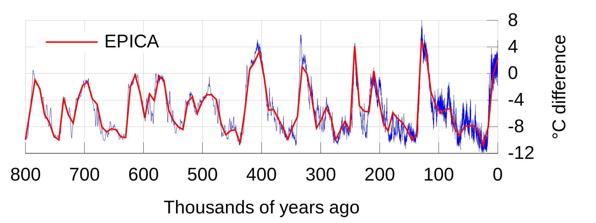

<center></center>

<br>The full analysis of this project can be read as on my <a href ="https://u4see.org/data/Weather%20Trends/weather_trends.pdf">website.</a><br>
A Github repository with all the files and folders is available <a href="https://github.com/AviadGiat/data-analysis/tree/master/Explore%20Weather%20Trends">here.</a><br><br>

### <strong>Outline</strong>
I chose to do this project on the biggest city next to me, which is San Francisco, California. I added 3 more cities to this analysis to compare the average weekly temperatures in SF with them.<br>
To accomplish the visualization of this project I used a few SQL lines to download the global average temperatures and the average temperatures in: San Francisco; Rio De Janeiro; London; and Helsinki. I downloaded the raw temperature data from Udacity's server to my machine;<br>
I used R to write the code and Rstudio to produce the .pdf file.
With R I created a new column for each table (xls file in this stage) with the weekly average from the 7th record until the last one. This left 6 empty rows (first lines that do not have 7 days prior to its date).
Before plotting the data I merged the datasets mentioned above to one dataframe called 'weather'.
To plot the data I used the package ggplot2, which I worked with before and is a great tool for fast and easy plotting.<br><br>

The SQL line I used on Udacity's server to retrieve the data I wanted:
<blockquote> <h5>select * from city_data where city = 'San Francisco';<br>
select * from global_data;<br>
select * from city_data where city = 'Helsinki'<br>
select * from city_data where city = 'Rio De Janeiro'<br>
select * from city_data where city = 'London'<br>
select * from city_data where city = 'San Francisco'<br>
</h5></blockquote>


### <strong>A quick examination of the dataset </strong>
The first lines of the merged dataset
```{r upload_munge, echo=FALSE, message=FALSE, warning=FALSE}

# Upload libraries
library(plyr)
library(dplyr)
library(ggplot2)
library(plotly)


# Create new dataframes from csv files
sf <- read.csv('sf.csv', stringsAsFactors = TRUE)
helsinki <- read.csv('helsinki.csv', stringsAsFactors = TRUE)
rio <- read.csv('rio.csv', stringsAsFactors = FALSE)
london <- read.csv('london.csv', stringsAsFactors = TRUE)
global <- read.csv('global.csv', stringsAsFactors = TRUE)
cities <- read.csv('all_cities.csv', , stringsAsFactors = TRUE)

# Remove NA's and empty strings from the weekly average columns
sf <- sf[!is.na(sf$weekly_avg_sf), ]
helsinki <- helsinki[!is.na(helsinki$weekly_avg_helsinki), ]
rio <- rio[!(rio$weekly_avg_rio == ""), ]
london <- london[!is.na(london$weekly_avg_london), ]
global <- global[!is.null(global$weekly_avg_global), ]

# Turn the character column to numeric in the rio dataframe
rio$weekly_avg_rio <- as.numeric(rio$weekly_avg_rio)

# Show dataframes
# sf
# helsinki
# rio
# global
# london

# Merge the san francisco and global datasets
weather_sf <- left_join(sf, global, by = 'year')

# Merge the helsinki and global datasets
weather_helsinki <- left_join(helsinki, global, by = "year")

# Merge the rio and global datasets
weather_rio <- left_join(rio, global, by = "year")

# Merge the london and global datasets
weather_london<- left_join(london, global, by = "year")

# Merge all cities' dataframes
weather <- join_all(list(weather_london, weather_sf, weather_helsinki, weather_rio), by = c('year', 'city', 'country', 'weekly_avg_global'), type = 'full')

weather <- select(weather, -c("avg_sf", "avg_temp","avg_sf", 'avg_global', 'avg_temp' ))

head(weather,1)

```
<br>
Basic statistics and structure of the different variables
```{r statistics, echo=FALSE, message=FALSE, warning=FALSE}
print(summary(weather))
str(weather)
```
<br>We can see above the years and weekly averages for San Francisco, Helsinki, London, Rio De Janeiro and for the entire Globe's temperatures statistics. The minimum weekly average of SF was 14 degrees and the max was 15. The global weekly average temperature was 7 at the minimum and 9.5 at the maximum. We can say that San Francisco is on the warm side of the planet's temperature distribution. Let's examine the correlation coefficient of San Francisco and the rest of the cities.<br><br>

### The correlation coefficient between the years variable and the weekly average in San Francisco
```{r correlation_sf, echo=FALSE, message=FALSE, warning=FALSE}

library("ggpubr") # for an easy ggplot2-based data visualization
weather_sf <- weather_sf[complete.cases(weather_sf), ]

ggscatter(weather_sf, x = "year", y = "weekly_avg_sf", title = "San Francisco",
          add = "reg.line", conf.int = TRUE, 
          cor.coef = TRUE, cor.method = "pearson",
          xlab = "Years and centuries (San Francisco)", ylab = "Temperature",
          shape = 20, palette = "RdBu", ellipse = TRUE,
          mean.point = TRUE, ggtheme = theme_minimal())

```
<br>The correlation coefficient between the average temperatures in SF and the year has the value of 0.67. (1 is perfect correlation and 0 is none)<br>
When looking at the P level, we can see that it is much smaller than 0.5 (2.2e-16 - is the smallest number of system can show), which means that we can reject the null hypothesis and say that there is a very strong correlation between the years advancement and the rise in temperature in San Francisco.


### The correlation coefficient between the years and the weekly average in Helsinki
```{r correlation_helsinki, echo=FALSE, message=FALSE, warning=FALSE}

ggscatter(weather_helsinki, x = "year", y = "weekly_avg_helsinki", 
          add = "reg.line", conf.int = TRUE, title = "Helsinki", 
          cor.coef = TRUE, cor.method = "pearson",
          xlab = "Years and centuries (Helsinki)", ylab = "Temperature",
          shape = 20, palette = "RdBu", ellipse = TRUE,
          mean.point = TRUE, ggtheme = theme_minimal())
```
<br>The change in the average weekly temperature in Helsinki from 1749 until 2013 was positive 5.2 degrees Celsius. It rose from a weekly average of 0.6 in 1749 to 5.9 degrees in 2013.
Helsinki was taken as a Northern country to compare to San Francisco. Helsinki has a very similar pattern to the San Francisco regression line. There is a  correlation between the years and the temperatures in this city and as the years go by the temperature increases exponentially. The regression line is not as steep as SF or Rio, but the p-value is practically 0 (2.2e-16), which tells us that the probability that the next year temperatures will rise in Helsinki is 99.999%. <br><br>


### Correlation coefficient between the years and the weekly average in Rio De Janeiro
```{r correlation_rio, echo=FALSE, message=FALSE, warning=FALSE}

ggscatter(weather_rio, x = "year", y = "weekly_avg_rio", 
          add = "reg.line", conf.int = TRUE, title = "Rio De Janeiro",
          cor.coef = TRUE, cor.method = "pearson",
          xlab = "Years and centuries (rio)", ylab = "Temperature",
          shape = 20, palette = "RdBu", ellipse = TRUE,
          mean.point = TRUE, ggtheme = theme_minimal())
```
<br>Rio De Janeiro was taken as a city from the Southern hemisphere. It has an almost perfect correlation (R = 0.9) between the years and temperatures. The P value here is also almost 0, so we reject the null hypothesis and say that there is a very strong correlation here as well.<br><br>


### Correlation coefficient between the years and the weekly average in London
```{r correlation_london, echo=FALSE, message=FALSE, warning=FALSE}

ggscatter(weather_london, x = "year", y = "weekly_avg_london", 
          add = "reg.line", conf.int = TRUE, title = "London",
          cor.coef = TRUE, cor.method = "pearson",
          xlab = "Years and centuries (london)", ylab = "Temperature",
          shape = 20, palette = "RdBu", ellipse = TRUE,
          mean.point = TRUE, ggtheme = theme_minimal())
```
<br>  We can see above that there is a strong correlation between the years and the temperature in London, as with the previous cities.
London was taken for its part in being the epicenter of the Industrial Revolution, which started in the 18th century. In the UK the Industrial Revolution during the 18th and 19th centuries was based on the use of coal. Industries were often located in towns and cities, and together with the burning of coal in homes for domestic heat, urban air pollution levels often reached very high levels. Scientists found that there is a <a href ="https://www.google.com/search?q=correlation+between+air+pollution+and+temperatures&rlz=1C1CHBF_enUS796US797&oq=correlation+between+air+pollution+and+temperatures&aqs=chrome..69i57.15315j1j4&sourceid=chrome&ie=UTF-8">strong correlation</a> between air pollution and rising air temperature. So, coal pollution might have been the first reason for rising temperatures in London, as can be seen in the following chart.


How are the above look next to each other and compared to the Global temperature change throughout the years and centuries?

### <strong>Cities VS Global weekly average temperatures</strong>
```{r plot_weekly_averages, echo=FALSE, message=FALSE, warning=FALSE}

# Plot
plot_weather <- ggplot(data = weather) +
  
  geom_smooth(aes(x=year, y=weekly_avg_sf)) +
  geom_smooth(aes(x=year, y=weekly_avg_global)) +
  geom_smooth(aes(x=year, y=weekly_avg_rio)) +
  geom_smooth(aes(x=year, y=weekly_avg_helsinki)) +
  geom_smooth(aes(x=year, y=weekly_avg_london)) +
  
  geom_line(aes(x=year, y=weekly_avg_global, colour="weekly_avg_global")) +
  geom_line(data = weather_sf, aes(x=year, y=weekly_avg_sf, colour="weekly_avg_sf")) +
  geom_line(data = weather_rio, aes(x=year, y=weekly_avg_rio, colour="weekly_avg_rio")) +
  geom_line(data = weather_helsinki, aes(x=year, y=weekly_avg_helsinki, colour="weekly_avg_helsinki")) +
  geom_line(data = weather_london, aes(x=year, y=weekly_avg_london, colour="weekly_avg_london")) +
  
  labs(x='Years', y='Temperature in Celsius') +
  scale_x_continuous(breaks = seq(1700, 2020, 30)) +
  scale_y_continuous(breaks = seq(0, 25, 2.5)) +
  theme(axis.text.x = element_text(angle = 45, hjust = 1))

# plotly
# plot_weather = ggplotly(plot_weather)
# Plot
plot_weather

```
<br>What can we see in the above chart?<br>
* San Francisco's average temperatures were higher, on average, 5.9 degrees than the Global average temperature for the same years. This trend seems to be consistent throughout the years and centuries.<br>
* The temperatures in SF went down very gradually from the beginning of records (1855) until 1913, when it started to rise.<br>
* Both London and Helsinki had a sharp increase in the temperature in the 18th century. <br>
* The Global temperatures, by this data, started to rise in the middle of the 18th century and rose since then.<br>
* Since 1913, temperatures in SF rose exponentially. <br>
* There seems to be a correlation between the years and the average temperatures, in all cases. <br><br>


### <strong>Cities VS Global weekly average temperatures</strong>
```{r min_max, echo=FALSE, message=FALSE, warning=FALSE}

# Find the minimum and maximum of each column
min <- apply(weather,2,min, na.rm = TRUE)
max <- apply(weather,2,max, na.rm = TRUE)

# Add a name to the first column
min$ID <- rownames(table)
max$ID <- rownames(table)

# Convert the list to dataframe
min <- as.data.frame(min)
max <- as.data.frame(max)

# Remove the first 3 columns
max <- max[, -c(1:3)]
min <- min[, -c(1:3)]

# Change columns names
min <- min %>% dplyr::rename("London" = weekly_avg_london,
                      "Global" = weekly_avg_global, 
                      "San Francisco" = weekly_avg_sf,
                      "Helsinki" = weekly_avg_helsinki,
                      "Rio De Janeiro" = weekly_avg_rio)

max <- max %>% dplyr::rename("London" = weekly_avg_london,
                      "Global" = weekly_avg_global, 
                      "San Francisco" = weekly_avg_sf,
                      "Helsinki" = weekly_avg_helsinki,
                      "Rio De Janeiro" = weekly_avg_rio)

# Melt the dataframes
library(reshape)
melted_min <- melt(min, id=c())
melted_max <- melt(max, id=c())

# Merge dataframes
min_max <- plyr::join(melted_max, melted_min, by = 'variable')

# Change columns names
names(min_max) <- c("City", "Max", "Min")

# Make numeric
min_max$Max <- as.numeric(as.character(min_max$Max))
min_max$Min <- as.numeric(as.character(min_max$Min))

# Find the difference between min and max
min_max <- min_max %>%
  group_by(City) %>%
  mutate(Diff = Max - Min)

# Print dataframe with the difference between the temperatures
print(min_max)

# Plot
ggplot(data=min_max, aes(x=City, y=Min, fill = City)) +
  geom_bar(stat = "identity", show.legend = FALSE) +
  geom_text(aes(label=Diff)) +
  geom_bar(stat = "identity", aes(x=City, y=Max), alpha = 0.5, show.legend = FALSE) +
  labs(y="Minimum and maximum") +
  ggtitle("Difference between lowest and highest average temperature")


```

<br>We can see above the difference between the minimum and maximum average temperatures in the 4 cities and global average. Helsinki experienced the biggest change in temperatures (5.21 degrees) since the beginning of records, followed by London with 3.44 degrees change since the beginning of the Industrial Revolution. Here are two external charts that show changes in global temperatures for the last thousand and 800 thousand years:<br>

```{r thousands, echo=FALSE, message=FALSE, warning=FALSE, out.width = "500px"}
  
```
<br>Source: <a href="https://en.wikipedia.org/wiki/Global_temperature_record">Wikipedia</a><br><br><br>

```{r hundreds, echo=FALSE, message=FALSE, warning=FALSE, out.width = "500px"}
  knitr::include_graphics('Holocene_Temperature_Variations.png')
```
<br>Source: <a href="https://en.wikipedia.org/wiki/Global_temperature_record">Wikipedia</a><br><br>

As can be seen in the above two charts, taken from Wikipedia, the trend that we have in our exploration here might very much fit the chart of the thousand years and of the ten thousand years. From this data, it seems that we are currently on a small heat wave of a couple of hundred years, and we are also on the hundred thosand year pick of a heat wave.


### <strong>Conclusion</strong>
The Earth's atmosphere has been steadily and exponentially heating up in the last few centuries. This was verified with 4 different cities and with the given Global average temperatures in the above dataset. I used the Pearson correlation coefficient to find the strength of relationships between the years and the weekly average temperatures.<br>
An interesting point to find out in further research is why Helsinki had such a big increase in temperatures during the last 200 hundred years. Is it also related to the smog produced by coal in the 18th century, as was the case with London?<br>
Another interesting avenue to explore is why there was a decline in average temperatures in San Francisco in the late 19th century and the beginning of the 20st century?<br><br>

Finally, We can expect to have higher temperatures, both locally and globally, if all the conditions that created the above trends remain the same, in the coming years and decades.<br><br>