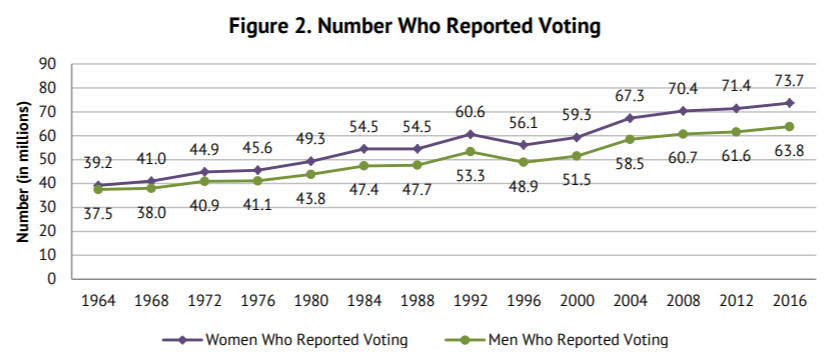

```{r setup, include=FALSE}
knitr::opts_chunk$set(echo = TRUE)
```

```{r, set_libraries, echo=FALSE, message=FALSE, warning=FALSE,  cache=TRUE}
####################################################################
##           LIBRARIES | UPLOAD DATA | SAMPLE FILE                ##
####################################################################

library(ggplot2)
library(gridExtra)
library(raster)
library(plyr)
library(dplyr)
library(tidyr)
library(csv)
library(data.table)
library(scales)
library(gender)
library(lubridate)
library(ggplot2)
library(ggmap)
library(maps)
library(mapdata)
library(dygraphs)
library(xts)
library(zipcode)
library(openintro) # Change abbr to full name for the state
library(tidyverse)
library(tmap)
library(tmaptools)
library(leaflet)
library(sf)
library(htmlwidgets)
library(httpuv)
library(plotly)
library(totalcensus)
library(DT)


####################################################################
##                         UPLOAD THE DATA                        ##
####################################################################

# Set working directory
setwd('C:/Users/Aviad/Google Drive/Studies/Data Analysis/6 - EDA/Final Project/2016 Elections Finance')

# Read the CSV file
finance <- fread("finance.csv")

# Turn the date column to type date
finance$date <- as.Date(finance$date)

# Create a dataframe with only 10K sample observations for faster results
set.seed(2986)
finance_sample <- finance[sample(1:nrow(finance), 10000), ]

# Remove the non-contiguous states
finance <- subset(finance, !(state %in% c("alaska", "hawaii", "puerto rico")))
```


```{r set_sources, echo=FALSE, message=FALSE, warning=FALSE,  cache=TRUE}
####################################################################
##                              SOURCES                           ##
####################################################################

# Sources: 
# https://classic.fec.gov/disclosurep/PDownload.do
# Dataset used = Contributor Data Download (ALL)
# https://cran.r-project.org/web/packages/gender/vignettes/predicting-gender.html
```


```{r set_file_dir, echo=FALSE, message=FALSE, warning=FALSE,  cache=TRUE}
####################################################################
##                INSPECT AND MUNGE THE DATA                      ##
####################################################################


# See the entire data inspection and data wrangling in the file "all-munge"
# under the same folder as the file you are reading.
```
<br>
```{r, top_img, echo=FALSE, message=FALSE, warning=FALSE,  fig.align="center", cache=TRUE}
knitr::include_graphics("2016 elections finance.jpg")
```
<center>(Cartoon by DonkeyHotey&nbsp;<a href="https://www.flickr.com/photos/47422005@N04/">via Flickr</a>.)</center><br>

### <strong>Introduction</strong>

In this EDA (<a href="https://en.wikipedia.org/wiki/Exploratory_data_analysis">Exploratory Data Analysis</a>) project I will explore a dataset of the 2016 elections' financial contributions, while examining its structure, variable, patterns and relationships between those variables.<br>

My goal with this project is to find interesting insights that could lead to further investigations.<br> 
I will start with exploring few one-variable distributions, compare them against the 'amount' variable and try to find interesting patterns and relationships between those variables.<br>

The data in this project was taken from the <a href="https://classic.fec.gov/disclosurep/PDownload.do">fcc.gov</a> website. It includes all individual campaign contributions for the 2016 presidential elections and contributions from authorized committees.<br>

The original dataset had 19 columns, which I reduced to 14 in order to limit the scope of this project.<br>

!Important to note that the 'finance' dataset uploaded here was 'munged' in a different file called 'all-munge.R', which can be found in the root folder of this project on <a href="https://github.com/AviadGiat/data-analysis/tree/master/Explore%20and%20Summarize%20Data">Github</a>. You can read more about the structure of this project in the readme.MD file, which is located in the root folder as well.<br>

The first variable to explore will be the 'amount' variable, which is the money a contributor donated to one or more of the candidates and is the only vector in the downloaded dataset that is not a character, rather a numeric vector.<br>

First, lets look at the dataset, get familiar with the variables and ask questions about the data.


##### <strong>How many rows (individual contributions) and columns the dataset has?</strong>
```{r data_dim, echo=FALSE, message=FALSE, warning=FALSE, cache=TRUE}
dim(finance)
names(finance)
```
We can see above that now the data set has 7,299,993 million observations of contributions contributed, with 14 different columns that correspond to each observation. The columns' names meanings are: 

"cand_id" - candidate ID<br>
"candidate" - Candidate name<br>
"contributor" - Contributor name<br>
"city" - Contributor city<br>
"state" - Contributor state<br>
"zipcode" - Contributor zipcode<br>
"employer" - Contributor employer<br>
"occupation" - Contributor occupation<br>
"amount" - Amount contributed<br>
"date" - Contribution transaction date<br>
"tran_id" - The contribution transaction ID<br>
"election_tp" - Election type (General or Primaries)<br>
"party" - The political party of the candidate<br>
"gender" - The contributor's gender<br><br>


#### <strong>Example of a few lines from the dataset</strong>
```{r row_example, echo=FALSE, message=FALSE, warning=FALSE, cache=TRUE}
library(DT)
# datatable(finance_sample, 
#           extensions = c('Buttons', 'FixedColumns', 'Responsive'), 
#           options = list(dom = 't', buttons = I('colvis'), scrollX = TRUE, 
#                          pageLength = 5, fixedHeader = TRUE))
head(finance)
```


#### <strong>The variables' basic statistics</strong>
```{r summary_finance, echo=FALSE, message=FALSE, warning=FALSE, cache=TRUE}
finance_summary <- finance
finance_summary <- finance_summary %>%
  mutate_if(sapply(finance_summary, is.character), as.factor)
summary(finance_summary)

```
<br>Many different interesting points about the data can be seen in the above table and act as a 'trailhead' for investigative avenues. Let's look at a few of them:<br>
It seems that Hillary Clinton, under the 'candidate' column, had the highest number of occurrences, followed by Bernie Sanders and Donald Trump. Did she also lead with the total amount of contributions and not only the number of contributions?<br>
Other things we can see in this first glance at the dataset with the number of distributions are:<br>
New York is the leading city with 204,204 contributions; California is the leading state with the highest number of contributions (1,294,446); Retired people take the first and second places with a number of contributions under the 'occupation' and 'employer' variables; The Democratic party had about 4 times more contributions than the Republican party (5,556,219 / 1,786,731); The amounts donated to all parties started from few cents and reached 4,904,861, which was made by a single contributor. I wonder who that was.<br>
I will focus on only few of the questions and variables above in the scope of this project and drill down where there is a need to understand better the distributions and connections between the variables.<br><br>


## One variable exploration<br>

### <strong>Amount</strong>

<strong>Let's see first how much money was contributed in these elections by all contributors</strong>.
```{r finance_amount, echo=FALSE, message=FALSE, warning=FALSE, cache=TRUE}
sum(as.numeric(finance$amount), na.rm = TRUE)
```
The sum of all contributions to all candidates in 2016 elections was $932,698,768.

#### <strong>Plot the amount variable's distribution</strong>
```{r amount_dist, echo=FALSE, message=FALSE, warning=FALSE, cache=TRUE}
p1 <- qplot(data=finance, amount, geom = "histogram", bins=30) +
  scale_x_continuous(limits = c(0, quantile(finance$amount,0.97))) +
  scale_y_continuous(labels = comma) +
  labs(y = "Contributions") +
  theme(axis.text.x = element_text(angle = 45, hjust = 1)) +
  ggtitle("Without the top 3% contributions")

p2 <- qplot(data=finance, amount, geom = "histogram", bins=30) +
  scale_x_continuous(labels=comma) +
  scale_y_continuous(labels = comma) +
  theme(axis.text.x = element_text(angle = 45, hjust = 1)) +
  labs(y = "Contributions") +
  ggtitle("Contributions per amount")

grid.arrange(p2, p1, ncol=2)

ggsave('The sum of all contributions to all cadidate in 2016.png')

```
<br>The first (left) plot seems to be a non-descriptive one, but in fact we can learn a few basic things about the 'amount' distribution from it. First, we can see the huge gap between the highest and lowest contributions, following the x axis amounts. Second, we can see from the first plot that most of the contributions were not very far from 0 and, for sure, not in the millions. Looking at the second plot above we can see that indeed most of the contributions were below $200, after dropping the top 3% of the contributions. The median contribution in this distribution is $28. I will split the amount donated to big and small donors on the $200 mark and check which candidates were supported by big and small contributors.<br><br>


#### <strong>The amount distribution after taking the log10</strong>
```{r amount_log10, echo=FALSE, message=FALSE, warning=FALSE, cache=TRUE}
qplot(data=finance, amount, geom = "histogram", bins=30) +
  scale_x_log10(finance_sample$amount +1, labels = comma) +
  labs(x = "Amount", y = "Distribution")
ggsave('amounts contributed distribution log10.png')

```
<br>With less outliers and variability, it is easier to look at the data and its distribution in what seems now like a normal distribution.<br><br>

### <strong>Candidate</strong>

### <strong>Who were the candidates and which party they represented</strong>
```{r candidates, echo=FALSE, message=FALSE, warning=FALSE, cache=TRUE}
finance_candidates <- finance

finance_candidates <- finance_candidates %>%
  group_by(candidate, party) %>%
  summarise(count = n(), sum = sum(amount))

ggplot(data = finance_candidates, aes(x = candidate, y = sum, fill = party)) +
  geom_bar(stat = "identity") +
  theme(axis.title.x=element_blank(),axis.ticks.x=element_blank(),
        axis.title.y=element_blank()) +
  scale_y_log10(labels = comma) +
  coord_flip()


```
<br>We had 18 Republicans, 5 Democrats, 1 Independent and 1 Green, out of 25 candidates in 2016 elections.
Republicans outnumbered the Democrats 3 times and 18 times the Green and Independent parties.<br>
There are many questions that this party map of candidates brings up. First, why do the Republicans have so many more candidates than the other next big party?<br>
Another obvious point is that there were mainly two parties competing in these elections, where the small ones seemed to have a very slim chance of winning. This is not just because of the minimal representation by candidates, it is also because the respectively small amounts that were collected by those parties compared to the two big ones, which will be demonstrated later on.<br>
The American political system has been based on <a href="https://en.wikipedia.org/wiki/Party_system#Types_of_party_systems">two-system-party</a> since its inception, with the Federalists and the Democratic-Republican Parties, until today with the Democratic and Republican parties. An interesting question for further investigation can be, what are the chances of a third party to be counted in the American political system, and can we learn this from the available data?<br><br>


#### <strong>Which were the most popular amount contributions?</strong>
```{r amount_top_freq, echo=FALSE, message=FALSE, warning=FALSE, cache=TRUE}
amount_top_freq <- sort(table(finance$amount),decreasing=TRUE)[1:10]
amount_top_freq
```
The most frequent contributions were 25, 50, 100, 10, 15, 5,  27, 250, 35 and 20. 9 out of the 10 amounts are multiplications of 5. The 7th amount in line is $27. This is the number that Bernie Sanders' campaign advertised as their most popular contribution.<br><br>


#### <strong>Facet the number of contributions by all candidates (up to $250)</strong>
```{r amount_facets, echo=FALSE, message=FALSE, warning=FALSE, cache=TRUE}
ggplot(data = finance_sample, aes(x=amount)) + 
  scale_y_continuous(trans = sqrt_trans(), 
                     labels = comma, breaks = c(1000, 2000)) +
  geom_histogram(binwidth=10) +
  scale_x_continuous(labels=comma, limits = c(0,250), 
                     breaks=seq(0,1250,50)) +
  theme(axis.text.x = element_text(angle = 45, hjust = 1)) +
  theme(axis.text.y = element_text(angle = 45, hjust = 1)) +
  facet_wrap(~candidate)
ggsave('amount contributed distribution faceted by all candidates.png')
```
<br>Looking at the different histograms, Hillary Clinton seems to lead with number of contributions, followed by Sanders and Trump. It is not clear from this plot who are the next ones in descending order. It seems that it can be Rubio, Cruz, Bush or Carson. I will dive into who really received the highest number of contributions and who received the highest amount of contributions.<br><br>


#### <strong>Compare the number of contributions per candidate with a bar plot</strong>
```{r num_contributions, echo=FALSE, message=FALSE, warning=FALSE, cache=TRUE}
# Calculate the numbers with dplyr
num_contributions <- finance %>%
  group_by(candidate) %>%
  unique()%>%
  summarise(number = n())%>%
  arrange(desc(number))

# Plot the number of contributions per candidate
ggplot(data = num_contributions, aes(x= reorder(candidate, -number),
                                    y=number,  fill = candidate)) + 
  geom_bar(stat = "identity") +
  theme(axis.text.x = element_text(angle = 45, hjust = 1))+
  scale_y_continuous(labels = comma) +
  xlab("Candidate")
ggsave('number of contributions candidates received.png')
```
<br>The bar plot says it all. Clinton lead these elections with the number of contributions, followed by Sanders, Trump, Cruz, Carson, Rubio, Paul, Fiorina, Bush and Kasich, in this order. So, how many contributions exactly each of the top 10 candidates received?<br><br>

#### <strong>Number of contributions and percent per candidate</strong>
```{r cand_distr, echo=FALSE, message=FALSE, warning=FALSE, cache=TRUE}
# Percent of contributions per gender
cand_distr <- group_by(finance, candidate)
cand_distr <- summarise(cand_distr, contributions = n())
cand_distr <- cand_distr[order(-cand_distr$contributions),]
cand_distr$percent<- round(as.numeric(prop.table(cand_distr$contributions)*100), 2)
cand_distr
# datatable(cand_distr, 
#           extensions = c('Buttons', 'FixedColumns', 'Responsive'), 
#           options = list(dom = 't', buttons = I('colvis'), scrollX = TRUE, 
#                          pageLength = 25, fixedHeader = TRUE))
```
Hillary Clinton received 48% of the total contributions, followed by Bernie Sanders with 27% and then Donald Trump with only 10% of the total contributions in both the primaries and the general elections. Hillary Clinton received 4.5 times more contributions than Donald Trump, yet it did not help her to win the race.<br><br>


### <strong>Occupation</strong>

#### <strong>Which occupation gave most donations?</strong>
```{r occupation, echo=FALSE, message=FALSE, warning=FALSE, cache=TRUE}
finance_occupation <- finance

finance_occupation <- finance_occupation %>%
  group_by(occupation) %>%
  summarise(number = n(), sum = sum(amount)) %>%
  mutate(percent = round(number/sum(number) * 100, 1)) %>%
  filter(number > 50000) %>%
  arrange(desc(number))
finance_occupation

# datatable(finance_occupation, 
#           extensions = c('Buttons', 'FixedColumns', 'Responsive'), 
#           options = list(dom = 't', buttons = I('colvis'), scrollX = TRUE, 
#                          pageLength = 25, fixedHeader = TRUE))
```
<br>This chart above cannot tell us much since there are about 120,000 occupations that donors added to their contribution forms. The text in the field was open to insert any characters without restriction, thus many occupations were written many times in different variations<br>
In order to analyze this facet of the dataset, we will have to write an algorithm that searches for similar terms and combine them together.<br>
Nevertheless, in the above chart the percent of retired donors is pretty impressive, compared to them being 14.5% of the population in 2016.<br>
Also interesting to see here is the high percentage of donors who filled 'unemployed' at that time. I would think unemployed people won't have the money to donate, but they did, in their ten thousands.<br><br>


#### <strong>Contributions by occupation (above 50,000 contributions)</strong>
```{r contrib_by_occupation, echo=FALSE, message=FALSE, warning=FALSE, cache=TRUE}

library(grid)
ggplot(data = finance_occupation, aes(x = reorder(occupation, number), 
                                      y = number, fill = occupation)) +
  geom_bar(stat = "identity") +
  ylab("Number of contributions") +
  xlab("Occupation") +
  geom_text(aes(x = occupation, y = number + .5,    # nudge above top of bar
                  label = paste0(percent, '%')), hjust = +0.5,
            position=position_dodge(), vjust=-0.25) +
  theme(axis.text.x = element_text(angle = 45, hjust = 1), 
        legend.position="none") +
  scale_y_continuous(expand = c(0.15,0))

```
<br><br> 

### <strong>Gender</strong>

#### <strong>Who contributed more in those elections, men or women?</strong>
```{r gender_distr, echo=FALSE, message=FALSE, warning=FALSE, cache=TRUE}
# Number of contributions per gender
gender_distr <- group_by(finance, gender)
gender_count <- gender_distr
gender_count <- summarise(gender_distr, contributions = n())

# Plot
ggplot(data=gender_count, aes(x=gender, y=contributions, fill = gender)) +
  geom_bar(stat = "identity") +
  scale_y_continuous(labels = comma)
ggsave('men and women contributions.png')
```
<br>Women had a slight lead with the number of contributions.<br><br>

#### <strong>Male and female contributions in numbers</strong>
```{r gender_count, echo=FALSE, message=FALSE, warning=FALSE, cache=TRUE}
# Number of contributions per gender
gender_count

# datatable(gender_count, 
#           extensions = c('Buttons', 'FixedColumns', 'Responsive'), 
#           options = list(dom = 't', buttons = I('colvis'), scrollX = TRUE, 
#                          pageLength = 25, fixedHeader = TRUE))

```
Women contributed 3,712,479 times and men contributed 3,661,116 time.
Interesting to note here that women also voted more than men in those elections. not only contributed more.
By the Center for American Women and Politics, since 1964, women voted more than men in every election.
```{r women_men_vote_img, echo=FALSE, , cache=TRUE, fig.cap="Source: Center for American Women and Politics", out.width = '100%'}


```
<br>Why did women vote or contributed more than men? Maybe it is related to the <a href="https://www.kff.org/other/state-indicator/distribution-by-gender/?currentTimeframe=0&sortModel=%7B%22colId%22:%22Location%22,%22sort%22:%22asc%22%7D">fact</a> that there were 51% women and 49% men in the US in 2016? That is a very interesting question to study in <a href="http://oxfordre.com/politics/view/10.1093/acrefore/9780190228637.001.0001/acrefore-9780190228637-e-71">further research</a> about women involvement in political issues, which, unfortunately, is out of the scope of this project.<br><br>

### <strong>Date</strong>

#### <strong>Number of contributions per day</strong>
```{r finance_date, echo=FALSE, message=FALSE, warning=FALSE, cache=TRUE}
date <-  finance
date <- date %>%
  group_by(date) %>%
  summarise(Contributions = length(amount))

# Plot
ggplot(data=date, aes(x=date, y=Contributions)) +
  geom_bar(stat='identity') +
  scale_y_log10() +
  scale_x_date(date_labels = "%b - %Y", date_breaks = "1 month",
                 limits = as.Date(c('2015-01-01','2017-01-01'))) +
  scale_y_continuous(labels=comma)+
  geom_vline(xintercept = as.numeric(as.Date("2016-06-01")), 
             linetype=4, color = "red") +
  geom_vline(xintercept = as.numeric(as.Date("2016-06-07")), 
             linetype=4, color = "blue") +
  geom_vline(xintercept = as.numeric(as.Date("2016-11-08")), 
             linetype=4, color = "green") +
  theme(axis.text.x = element_text(angle = 45, hjust = 1)) 

```
<br>Red and blue lines, respectively, are the Republican and Democratic primaries and the green line is the general election.<br>

People started to donate already in 2014, but in very small numbers, as can be seen further down. Most of the donors started contributing in early 2015 and until November 2016. Some kept on giving even after the elections, but it died after January 2017. We can see a steady built-up of the amount donated leading to the highest amounts given in the months and days before the general election. 
There was a pick of contributions between February and June of 2016 and a drop right after. This might be related to the Republican and Democratic primaries that took place between January 1st, 2016 and Jan 15th, 2016. I will facet the contributions by date and election type further down the exploration to check this out.<br><br>


### <strong>Employer</strong>

#### <strong>Which were the top leading employers?</strong>
```{r employer, echo=FALSE, message=FALSE, warning=FALSE, cache=TRUE}

# Create a new dataframe with the states
employer <- finance
employers <- employer %>%
  group_by(employer) %>%
  summarise(count = n(), sum = sum(count)) %>%
  arrange(desc(count))

employers$percent = round(as.numeric(prop.table(employers$count)*100), 2)
employers <- head(employers, 25)
employers
# library(DT) # Great table to do filtering with, when needed
# datatable(employers, extensions = c('Buttons', 'Responsive'),
#           options = list(dom = 'f', pageLength = 25))

# library(formattable)
# formattable(employers, align = c("l", rep("r", NCOL(employers) - 1)),
#             list(`employers` = formatter("span", style = ~ style(color = "grey", font.weight = "bold")), 
#                  `sum` = color_bar("#FA614B")))
```
<br>We can see in the table above that the same issue arises as we had with the 'occupation' variable. There are duplicated names that harm the completeness and integrity of the data. This variable will have to go through a process of wrangling in order to minimize the duplicated names as much as possible.<br>
Searching in the table above for 'retired' brought dozens of different names of 'employee' containing this keyword. The same goes to self employed when looking for the keyword 'self'.<br>
It will be very interesting to see if after wrangling the data and consolidating the employer name to a unique one, 'self employed', 'retired' and 'not employed' still lead the count of contributions?<br>
scrolling down the list, we can see the top names of employers that had the highest number of employees' contributions. The list includes Google, IBM, AT&T and Microsoft at the lead, as private companies. We can also see that government employees contributed with the State of California leading the .gov offices/agencies.<br><br>


#### <strong>Which were the top 10 leading states with contributions?</strong>
```{r state, echo=FALSE, message=FALSE, warning=FALSE, cache=TRUE}

# Create a nw dataframe with the states
finance_states_df <- finance

finance_states_df %>%
  group_by(state) %>%
  summarise(count = n()) %>%
  arrange(desc(count)) %>%
  head(10)

```
<br>California is leading the states with 1,294,446 contributions, about twice ahead of the next state in line, New York, with 640,831 contributions. Were those contributions related to the population of the states?
I will find that now under the 2-variable section.<br><br>


## Two variable exploration<br><br>

### <strong>Amount/State</strong>

#### <strong>Is there a correlation between the state's population and number of contributions? </strong>
```{r amount_state, echo=FALSE, message=FALSE, warning=FALSE, cache=TRUE}
# library(GGally) # For ggpairs
# finance_relation_pop_count <- finance_states_merged
# 
# finance_relation_pop_count <- finance_relation_pop_count %>%
#   group_by(state, population, "contributions"=count, "total"=sum, average = mean(sum)) %>%
#   summarise(percent = round(count/population*100, 0)) %>%
#   arrange(desc(contributions))
# 
# finance_relation_pop_count <- finance_relation_pop_count[, c(1:6)]
# 
# finance_relation_pairs <- finance_relation_pop_count
# finance_relation_pairs_1 <- finance_relation_pop_count
# 
# finance_relation_pairs_1$state <- NULL
# finance_relation_pairs$state <- NULL
# 
# finance_relation_pairs <- ggpairs(finance_relation_pairs) +
#   theme(axis.text.x = element_text(angle = 45, hjust = 1),
#         cardinality_threshold = NULL)
# finance_relation_pairs
# 
# # saveWidget(finance_relation_pairs, "correlations between population amd contributions.html")
# ggsave('finance_relation_pairs.png')
# 
# knitr::include_graphics("finance_relation_pairs.png")
```
<br>We can see that there is a very strong correlation (0.935) between the number of contributions per state and the number of citizens in this state. In a further investigation I would analyze the correlation between cities and their financial contributions to the different parties.<br><br>


### <strong>Contribution/Candidate</strong>
```{r cand_amount, echo=FALSE, message=FALSE, warning=FALSE, cache=TRUE}
# Percent of contributions per gender
cand_amount <- group_by(finance, candidate)
cand_amount <- summarise(cand_amount, contributions = n(), sum = sum(amount))
cand_amount <- cand_amount[order(-cand_amount$sum),]
cand_amount$percent<- round(as.numeric(prop.table(cand_amount$sum)*100), 2)
cand_amount

# datatable(cand_amount, 
#           extensions = c('Buttons', 'FixedColumns', 'Responsive'), 
#           options = list(dom = 't', buttons = I('colvis'), scrollX = TRUE, 
#                          pageLength = 25, fixedHeader = TRUE, 
#                          fixedColumns = list(leftColumns = 0,
#                                              rightColumns = 1)))


```
As we can see, only 8 candidates out of the 25 had more than 1% of the sum of all contributions. Hillary Clinton received 52% of the contributions, followed by Donald Trump with 13% and Bernie Sanders with 11%.

### <strong>Contributors</strong>

#### <strong>Top 10 donors who contributed the highest total amounts</strong>
```{r finance_contributor, echo=FALSE, message=FALSE, warning=FALSE, cache=TRUE}
# Who donated the highest amounts?
finance_contributor <- finance

finance_contributor <- finance_contributor %>%
  group_by(contributor) %>% 
  summarise(count = n(), average = round(mean(amount), 0), sum = sum(amount))%>%
  arrange(desc(sum)) 
finance_contributor

# datatable(finance_contributor, 
#           extensions = c('Buttons', 'FixedColumns', 'Responsive'), 
#           options = list(dom = 't', buttons = I('colvis'), scrollX = TRUE, 
#                          pageLength = 25, fixedHeader = TRUE))


```
<br>In 2016 elections rich donors could contribute as much as $360,000. With Hillary Clinton's campaign. That's how it worked: Donors who were rich - and willing - could give $5,400 to the Clinton campaign, $33,400 to the Democratic National Committee and $10,000 to each of the state parties (32 with Democratic committees), about $350,000 in all. A joint fundraising committee gave the donor do it all <a href="https://www.npr.org/2015/12/23/460762853/how-hillary-clinton-could-ask-a-single-donor-for-over-700-000">with a single check</a>.<br>
On Jan. 1, the contribution limits reset for the party committees, and the Hillary Victory Fund could go back to its donors for another $350,000 in party funds.<br>
While the maximum donation to a presidential campaign was&nbsp;<a href="http://www.fec.gov/info/contriblimitschart1516.pdf" target="_blank">$2,700 for the primary</a>&nbsp;elections (plus another $2,700 for the general), the Hillary Victory Fund&nbsp;<a href="http://www.npr.org/2015/12/23/460762853/how-hillary-clinton-could-ask-a-single-donor-for-over-700-000" target="_blank">could accept much larger contributions</a>&nbsp;because it was a so-called joint fundraising committee comprised of multiple committees.<br>
So, the Hillary Victory Fund was a fake contributor, and an extreme outlier, in our data. The lack of information about the real contributors must have some kind of influence on one or more analysis of the variables looked at in this project. The HVF funneled big amounts of money for Hillary Clinton's campaign, using the states' committees as a legal stamp to send money way and back to reach the maximum amount per donor, leaving only 1% of the contributions to the state's committees. As a result, we do not know from the data we have, which is the government's official 2016 contributions database, who gave and how much they gave to Clinton, from her biggest donors. Democratic donors, knowing the funds would end up with Clinton's campaign, wrote <a href="https://www.opensecrets.org/pres16/contributors?id=N00000019">six-figure checks</a> to influence the election - 100 times larger than allowed. (from <a href ="https://www.investors.com/politics/commentary/the-anatomy-of-hillary-clintons-84-million-money-laundering-scheme/">investor.com</a>)<br>
The actual big contributors, that were masked by the HVF, like Google, Facebook, JPMorgan Chase & Co, Stanford University, US Dept of State and others, can be found <a href ="US Dept of State">here.</a> 
<br>

#### <strong>Here are the rules for those years</strong>
```{r contributions_limits, echo=FALSE, message=FALSE, warning=FALSE, cache=TRUE}
knitr::include_graphics("spending limits.jpg")
```
<br>As we can see above, on the <ahrf ="https://transition.fec.gov/info/contriblimitschart1516.pdf">Fec's</a> chart, there were loopholes in the system that allowed transactions of unlimited monies between the state and the federal committees.

#### <strong>Number of candidates per contributor (more than 1 candidate)</strong>
```{r finance_donor_candidates, echo=FALSE, message=FALSE, warning=FALSE, cache=TRUE}
# Get Number of Candidates by Donor
finance_donor_candidates <- finance
finance_donor_candidates <- finance_donor_candidates %>%
  group_by(contributor, city) %>%
  summarise(number = length(unique(candidate))) %>%
  filter(number > 1) %>%
  arrange(desc(number))
# finance_donor_candidates

finance_donor_per_cand <- finance_donor_candidates 

finance_donor_per_cand <- finance_donor_per_cand %>%
  group_by(number) %>%
  summarise(count = n())
# finance_donor_per_cand

# length(unique(finance_donor_candidates$contributor))

# Plot
ggplot(data = finance_donor_per_cand, aes(x = number, y = count, 
                                          color = "blue")) +
  geom_line() +
  geom_point(color = "blue")+
  xlab("number of candidates contributed to") +
  ylab("number of donors")+
  theme(axis.text.y = element_text(angle = 45, hjust = 1), 
        legend.position="none") +
  scale_x_continuous(breaks = seq(0,14,1)) +
  scale_y_continuous(labels = comma) +
  ylim(0,40000)
  
ggsave('Number of candidates per donor.png')
```
<br>35,209 people contributed to more than 1 candidate, out of 1,307,046 recorded unique contributors, which is 2.7%. We can see that as the number of candidates goes up, the number of donors goes down, which seems logical. Who were the donor who contributed to maximum number of candidates?<br><br>


#### <strong>Contributors who donated to maximum candidates</strong>
```{r contributors_max_cand, echo=FALSE, message=FALSE, warning=FALSE, cache=TRUE}
contributors_max_cand <- finance

contributors_max_cand <- contributors_max_cand %>%
  group_by(contributor, city) %>%
  summarise(candidates = length(unique(candidate)), sum = sum(amount)) %>%
  arrange(desc(candidates)) %>%
  head()
contributors_max_cand

# datatable(contributors_max_cand, 
#           extensions = c('Buttons', 'FixedColumns', 'Responsive'), 
#           options = list(dom = 't', buttons = I('colvis'), scrollX = TRUE, 
#                          pageLength = 25, fixedHeader = TRUE, 
#                          fixedColumns = list(leftColumns = 0,
#                                              rightColumns = 1)))

```
<br>Wilson Kirk, from Dallas, Texas (there were couple of Wilson Kirks in this database), was the one to donate to maximum number of candidates, 9 in number.
Let's see some more information about him and his contributions with a plot.<br><br>


#### <strong># 1 contributor multi-candidate supporter</strong>
```{r multi_candidate_supporter, echo=FALSE, message=FALSE, warning=FALSE, cache=TRUE}

multi_candidate_supporter <- finance 
multi_candidate_supporter <- multi_candidate_supporter %>%
  subset(contributor == "WILSON, KIRK" & city == "DALLAS") %>%
  group_by(contributor, city, employer, date, amount) %>%
  unique() %>%
  arrange(date)

ggplot(data = multi_candidate_supporter, aes(x = date, y = amount, color =  candidate)) +
  geom_point() +
  scale_x_date(date_labels = "%b - %Y", date_breaks = "1 month", limits = as.Date(c('2015-01-01','2017-01-01'))) +
  theme(axis.text.x = element_text(angle = 45, hjust = 1))  +
  geom_line()


```
<br>Wilson Kirk, in 2015, contributed first to Fiorina and Huckabee and ended with Bush and Christie, while giving Bush 3 times. He then halted his contributions until the end of November, when he gave Trump twice. I wonder, as an obvious Republican supporter, why didn't he give to Trump throughout 2016?<br><br>


```{r finance_big_small_donors, echo=FALSE, message=FALSE, warning=FALSE, cache=TRUE}

finance_big_small_donors <- finance
finance_big_small_donors <- finance_big_small_donors %>%
  group_by(contributor, candidate) %>%
  summarise(count = length(amount), average = round(mean(amount), 0), sum = sum(amount))%>%
  arrange(desc(sum))

finance_big_small_donors$split_200 <- ifelse(finance_big_small_donors$sum > 200,
                                             "above $200","below $200")  

```
### <strong>Big and small donors</strong>

I will look now into Hillary Clinton's well-known claim that her campaign <a href ="https://www.politifact.com/nbc/statements/2016/mar/21/hillary-clinton/hillary-clinton-says-her-campaign-depends-small-do/">relied on small donations</a> (less than $100). I went ahead, doubled the number and cut the data on the $200 mark (as other sources suggested), as the point that separates big and small donors.<br>

#### <strong>How many Hillary's donors were small and how many big, then?</strong>
```{r finance_big_small_donors_hill, echo=FALSE, message=FALSE, warning=FALSE, cache=TRUE}

finance_big_small_donors_hill <- finance_big_small_donors
finance_big_small_donors_hill <- finance_big_small_donors_hill %>%
  filter(candidate == "Clinton")
table(finance_big_small_donors_hill$split_200)

```
<br> As we can see above, Clinton had almost 2.5 times more contributions above $200 and not as she claimed.
I wonder what the ratio is for Trump and Sanders, who were her two main opponents in the two elections.<br><br>


#### <strong>Trump's ratio between big and small donors</strong>
```{r finance_big_small_donors_trump, echo=FALSE, message=FALSE, warning=FALSE, cache=TRUE}

finance_big_small_donors_trump = finance_big_small_donors
finance_big_small_donors_trump <- finance_big_small_donors_trump %>% 
  filter(candidate == "Trump")

table(finance_big_small_donors_trump$split_200)
```
<br>Trump had almost 3.5 times more small donors than big donors!<br><br>


#### <strong>Sander's ratio between big and small donors</strong>
```{r finance_big_small_donors_sanders, echo=FALSE, message=FALSE, warning=FALSE, cache=TRUE}

finance_big_small_donors_sanders = finance_big_small_donors
finance_big_small_donors_sanders <- finance_big_small_donors_sanders %>% 
  filter(candidate == "Sanders")

table(finance_big_small_donors_sanders$split_200)
```
<br>Sanders had almost the same number of small and big contributors. He had 1.1 more big donors than small ones.<br>
Let's see the distribution of contributions above and below $200 for all candidates in a graph.<br><br>


#### <strong>Big and small contributors per candidates(split on $200)</strong>
```{r finance_big_small_donors_graph, echo=FALSE, message=FALSE, warning=FALSE, cache=TRUE}
finance_big_small_donors_graph <- finance_big_small_donors

finance_big_small_donors_graph <- finance_big_small_donors_graph %>%
  group_by(split_200, candidate) %>%
  summarise(number = n())
  
# Plot
ggplot(data = finance_big_small_donors_graph, 
       aes(x = reorder(candidate, number), y = number, fill = split_200)) +
  geom_bar(stat = "identity") +
  theme(axis.text.x = element_text(angle = 45, hjust = 1)) +
  coord_flip() +
  scale_y_continuous(labels = comma) +
  ylab("Number of contributions") +
  xlab("Candidate")
ggsave('candidates and big-small donors.png')

```
<br>It seems that every candidate received more money from 'big donors' than small ones in 2016's elections, except Donald Trump.
Trump by far passed the rest of the candidates with small donors' contributions. Hillary, on the other hand, was the biggest consumer of big donations, while Sanders, Cruz and Carson receive more balanced ratio of contributions from small and big donors.<br>
Working on the above data, I noticed that some people contributed more than once. Let's see who they were.<br><br>


#### <strong>Repeating contributors</strong>
```{r finance_repeating_donors, echo=FALSE, message=FALSE, warning=FALSE, cache=TRUE}
finance_repeating_donors <- finance_big_small_donors

finance_repeating_donors %>%
  arrange(desc(count)) %>%
  head()

```
Wow! Some people contributed hundreds of times. Truitt Roberta, as the leader on this plot, donated 1,520 times with an average of $1, and she gave to the Clinton campaign. There can be many reasons for that. It can be an automated system that does the online contributions for a person or an army of trolls who pump-up the number of contributions for their candidate.
An interesting question here for me is who was the candidate that had the highest number of repeating contributors?
I will consider here that extreme-repeating contributors as ones who donated more than 100 times.<br><br>


#### <strong>Candidates and repeating contributors</strong>
```{r finance_repeating_donors_cand, echo=FALSE, message=FALSE, warning=FALSE, cache=TRUE}
extreme_contributors <- finance_repeating_donors
extreme_contributors <- extreme_contributors %>%
  group_by(candidate) %>%
  filter(count > 100) %>%
  summarise(sum_count = sum(count), average = mean(count)) %>%
  arrange(desc(sum_count))
extreme_contributors

ggplot(data = extreme_contributors, aes(x= reorder(candidate, -sum_count), y = sum_count, fill = candidate)) +
  geom_bar(position = 'dodge', stat = "identity") +
  theme(axis.text.x = element_text(angle = 45, hjust = 1)) +
  geom_text(aes(label = round(average, 1)), vjust=-0.25) +
  ggtitle("Repeating contributions by candidate", 
          subtitle = "Restricted to only more than 100 contributions per contributor (Extreme Contributors)") +
  labs(x = "Candidate", y = "Number of repeating contributions") +
  scale_y_continuous(breaks = seq(0, 250000, 25000),labels = comma)
```
<br>Hilary Clinton was ahead of everyone else with more than 200K of 'extreme contributions', followed by Sanders with 75K. The number at the top of the bars is the average number of repeating contributors per extreme donor.<br><br>


### <strong>Party/Gender</strong>

#### <strong>Number of contributions parties received by gender (Democrats and Republicans)</strong>
```{r plot_count_contrib_party_gender_dems_reps, echo=FALSE, message=FALSE, warning=FALSE, cache=TRUE}

# Keep only Dems and Reps
per_contrib_party <- count_contrib_party
per_contrib_pty_gen_big <- subset(per_contrib_party, party == "Democrat" | party == "Republican")
per_contrib_pty_gen_small <- subset(per_contrib_party, party == "Green" | party == "Independent")

# Plot Dems and Reps
ggplot(data = per_contrib_pty_gen_big, aes(x=reorder(gender, -num_contrib), y = num_contrib, fill = gender)) +
  geom_bar(stat = "identity", color = "black") + facet_grid(.~party) +
  theme(axis.text.x = element_text(angle = 45, hjust = 1)) +
  scale_y_continuous(labels = comma) +
  xlab("Party") +
  ylab("Number of contributions") +
  scale_fill_brewer(palette = 9)
ggsave('number of contributions by gender dems reps.png')
```
<br>

#### <strong>Number of contributions parties received by gender (Democrats and Republicans)</strong>

```{r plot_count_contrib_party_gender_green_indep, echo=FALSE, message=FALSE, warning=FALSE, cache=TRUE}
# Plot Green and Independent
ggplot(data = per_contrib_pty_gen_small, aes(x=reorder(gender, -num_contrib), y = num_contrib, fill = gender)) +
  geom_bar(stat = "identity", color = "black") + facet_grid(.~party) +
  theme(axis.text.x = element_text(angle = 45, hjust = 1)) +
  scale_y_continuous(labels = comma) +
  xlab("Party") +
  ylab("Number of contributions") +
  scale_fill_brewer(palette = 5)
ggsave('number of contributions by gender green indep.png')

```


<br> Women contributed 1.2 times more than men for the Democratic party. At the other side of the aisle, the Republican men contributed 1.8 times more than women. The Green party had even wider gap between men and women's number of contributions. Men contributed twice as much as women to that party. The Independent party was the only one to have almost identical number of contributions from men and women.
We can also see here that Democrats received the highest number of contributions. Did they also receive the highest amount of contributions?<br><br>


#### <strong>Sum of contributions parties received</strong>
```{r sum_contrib_party, echo=FALSE, message=FALSE, warning=FALSE, cache=TRUE}
sum_contrib_party <- finance %>%
  dplyr::group_by(party) %>%
  dplyr::summarise(sum_contrib = sum(amount))%>%
  dplyr::arrange(desc(sum_contrib))
sum_contrib_party
```
<br>Democrats received $582M, almost twice as much as the Republicans.
The green party received $1M, which is more than 3 times contributors than the Independent party.<br><br>


#### <strong>Did women contribute more times to Hillary Clinton than men?<br>
What about Trump?</strong>
```{r H_female_contrib, echo=FALSE, message=FALSE, warning=FALSE, cache=TRUE}
library(tidyverse)
H_female_contrib <- finance
H_female_contrib <- H_female_contrib %>%
  group_by(gender,candidate) %>%
  filter(candidate == c("Trump", "Clinton"))%>%
  summarise(contr_num = n())

ggplot(data=H_female_contrib, aes(x=gender, y=contr_num, fill = gender)) + geom_bar(stat="identity", colour="black") +
    scale_fill_manual(values=c("#5090dc", "#db3434"))+
  scale_y_continuous(labels = comma) + facet_wrap(~candidate) +
  ylab("Number of contributions")
ggsave('Clinton and Trump contributions by genders.png')
```
<br>Women donated to Clinton 1.5 times more than men, and man donated to Trump 1.7 time more than women.
It seems that the gender's role with contributions to those two candidates was pretty dominant.<br><br>


## Multi-variable exploration<br>

### <strong>Election type</strong>

#### <strong>Facet contributions and dates by election type (General and Primaries)</strong>
```{r finance_date_type, echo=FALSE, message=FALSE, warning=FALSE, cache=TRUE}
finance_date_type <-  finance
# finance_date_type$date <- as.Date(finance_date_type$date)
finance_date_type <- finance_date_type %>%
  group_by(candidate, date, amount, election_tp) %>%
  summarise(total = sum(amount))

# Plot
ggplot(data=finance_date_type, aes(x=date, y=total)) +
  geom_bar(stat='identity') +
  scale_y_log10() +
  scale_x_date(date_labels = "%b - %Y", date_breaks = "3 month",
                 limits = as.Date(c('2015-01-01','2017-01-01'))) +
  scale_y_continuous(labels=comma, limits = c(0, 7000000))+
  geom_vline(xintercept = as.numeric(as.Date("2016-06-01")), 
             linetype=4, color = "red") +
  geom_vline(xintercept = as.numeric(as.Date("2016-06-07")), 
             linetype=4, color = "blue") +
  geom_vline(xintercept = as.numeric(as.Date("2016-11-08")), 
             linetype=4, color = "green") +
  theme(axis.text.x = element_text(angle = 45, hjust = 1)) +
  facet_wrap(~election_tp)

```
<br>Now, looking at the distribution of the donations, the voting pattern looks clearer. Donations were mostly given prior to an election. The assumption that the contributions peak we saw in the previous plot between February and June 2016 is related to the primaries, was correct.<br><br>


#### <strong>Number of contributions by gender and party in numbers and in a plot</strong>
```{r count_contrib_party, echo=FALSE, message=FALSE, warning=FALSE, cache=TRUE}

count_contrib_party <- finance %>%
  group_by(party, gender) %>%
  summarise(num_contrib = n())%>%
  arrange(desc(num_contrib))
count_contrib_party
```


#### <strong>Contributions by party overtime</strong>
```{r finance_date_party, echo=FALSE, message=FALSE, warning=FALSE, cache=TRUE}
finance_date_party <-  finance
# finance_date_party$date <- as.Date(finance_date_party$date)
finance_date_party <- finance_date_party %>%
  group_by(candidate, date, amount, party) %>%
  summarise(total = sum(amount))

# Plot
ggplot(data=finance_date_party, aes(x=date, y=total)) +
  geom_bar(stat='identity') +
  scale_y_log10() +
  scale_x_date(date_labels = "%b - %Y", date_breaks = "3 month",
                 limits = as.Date(c('2015-01-01','2017-01-01'))) +
  scale_y_continuous(labels=comma, limits = c(0, 7000000))+
  geom_vline(xintercept = as.numeric(as.Date("2016-06-01")), 
             linetype=4, color = "red") +
  geom_vline(xintercept = as.numeric(as.Date("2016-06-07")), 
             linetype=4, color = "blue") +
  geom_vline(xintercept = as.numeric(as.Date("2016-11-08")), 
             linetype=4, color = "green") +
  theme(axis.text.x = element_text(angle = 45, hjust = 1)) +
  facet_wrap(~party)

# Boxplot
# ggplot(aes(x = party, y = amount, fill = party), data = finance_date_party) + geom_boxplot() +
# theme(plot.title = element_text(size = 16), axis.text = element_text(size = 12), axis.title = element_text(size = 12,face = "bold")) + ylab("Contribution Amount") + xlab("Party") + ggtitle("Boxplot of Contribution Amount by Party") + scale_fill_manual(values = c("blue", "green", "white", "red")) +
#   scale_y_log10()

```
<br>Looking at the above faceted data, the trend we saw earlier with growing contributions over time and closer to the general elections, is missing from the Republican party. There actually seems to be trend down towards the General elections, on the Republican side.


#### <strong>Early contributions (2013-2014)</strong>
```{r finance_date_2013-2014, echo=FALSE, message=FALSE, warning=FALSE, cache=TRUE}
finance_date_2013_14 <-  finance

# Change the date column to a date type
# finance_date_2013_14$date <- as.Date(finance_date_2013_14$date)

# Group by date and compute the total, for 2013 and 2014
finance_date_2013_14 <- finance_date_2013_14 %>%
  subset(date > "2013-10-01" & date < "2014-12-31") %>%
  group_by(date, candidate, amount) %>%
  summarise(total = sum(amount), count = n())

# Plot
ggplot(data=finance_date_2013_14, aes(x=date, y=total)) +
  geom_line(mapping=aes(x=date, y=count, color=candidate, size=total, alpha = 0.4), size = 1) +
  scale_x_date(date_labels = "%b - %Y", date_breaks = "1 month") +
  scale_color_brewer(palette = "Set1") +
  scale_y_continuous(labels=comma) +
  theme(axis.text.x = element_text(angle = 45, hjust = 1)) +
  labs(x = "Date", y = "Sum of contributions")

```
<br>3 out of the 4 candidates who received early donations were Republicans; Cruz, Paul and Rubio. Rubio was the only one who received contributions in 2013 and most 2014. Did starting early helped Rubio? Let's see how much money each candidate collected along the way to the elections.

### <strong>Candidate/date</strong>

#### <strong>Accumulative sum of contributions candidates received</strong>
(active chart)
```{r finance_date_2013-2014_dyn, echo=FALSE, message=FALSE, warning=FALSE, cache=TRUE}
finance_date_cand <- finance
# finance_date_cand$date <- as.Date(finance_date_cand$date, "%Y-%m-%d")

finance_date_cand_group <- finance_date_cand

finance_date_cand_group <- finance_date_cand_group %>%
  subset(candidate == "Clinton" | candidate == "Trump" |
           candidate == "Cruz"  | candidate == "Carson"  | 
           candidate == "Rubio" |
           candidate == "Paul"  | candidate == "Sanders") %>%
  group_by(candidate, date) %>%
  summarise(sum = sum(amount), count = n()) %>%
  mutate(cumsum = cumsum(sum)) %>%
  # filter(sum > 2) %>%
  dplyr::select(date, everything()) %>%
  ungroup()

# Plot
finance_date_cand_plot <- ggplot(data=finance_date_cand_group, 
                                 aes(x=candidate, y=sum)) +
  geom_line(mapping=aes(x=date, y=cumsum, color=candidate, alpha = 0.9, 
                        group=candidate), size = 1) +
  scale_x_date(date_labels = "%b - %Y", date_breaks = "1 month", 
               limits = as.Date(c('2015-01-01','2017-01-01'))) +
  scale_color_brewer(palette = "Accent") +
  scale_y_continuous(labels=comma) +
  # coord_trans(y = "sqrt") +
  theme(axis.text.x = element_text(angle = 45, hjust = 1), 
        axis.text.y = element_text(angle = 45, hjust = 1)) +
  labs(x = "Date", y = "Accumulative sum") +
  theme(legend.position="bottom")
  # facet_wrap(~ candidate)

finance_date_cand = ggplotly(finance_date_cand_plot, height = 500) #, tooltip=c("count","candidate"))
htmlwidgets::saveWidget(finance_date_cand, "finance_date_cand.html")
finance_date_cand

```
<br>We can clearly see above that throughout the elections' cycles Clinton had a very strong financial lead over her running mates. 
Interesting to see in the above graph the end of each line, which looks like it represents the drop-off from the race. Trump received contributions for about two months after the General elections. Why would he need more campaign contributions after he already won the race? Interestingly enough, after some online research I found that all of the candidates kept on receiving donations even after they suspended their campaigns. So, why would any of the candidates who lost should keep on receiving donations?<br><br>

### <strong>State/City</strong>

#### <strong>A map with the sum of contributions by state and by city</strong>
```{r finance_map_states_cities, echo=FALSE, message=FALSE, warning=FALSE, cache=TRUE}
# 
# ################################################################################
# ## STATE GEO
# 
# # Upload the geographic data from a shape file downloaded from census.gove
# # https://www.census.gov/geo/maps-data/data/cbf/cbf_counties.html
# us_states <- read_shape("us_states/cb_2017_us_state_20m.shp",
#                         as.sf = TRUE, stringsAsFactors = FALSE)
# colnames(us_states)[colnames(us_states) == "NAME"] <- "state"
# us_states$state <- sapply(us_states$state, tolower)
# 
# ################################################################################
# ## STATE POPULATION
# 
# # Upload a dataset with the states population from census.gov
# # https://www.census.gov/data/datasets/time-series/demo/popest/2010s-national-total.html
# us_population <- read_csv("national_population.csv")
# us_population$state <- sapply(us_population$state, tolower)
# 
# ################################################################################
# ## STATE LOCAL
# 
# # The sample size is 14 times smaller than the population, hence the '*14' below
# finance_states <- finance %>%
#   group_by(state) %>%
#   summarise(average = mean(amount), sum = sum(amount),
#             count = length(amount), contributors = length(unique(contributor))) %>%
#   unique()
# 
# ################################################################################
# ## MERGE STATES LOCAL AND POPULATION
# 
# finance_pop_state <- merge(finance_states, us_population,
#                            by = "state", all.x=TRUE)
# 
# ################################################################################
# ## MERGE STATE LOCAL-POPULATION WITH STATE GEO
# 
# finance_states_merged <- merge(finance_pop_state, us_states, by = "state")
# finance_states_merged <- subset(finance_states_merged,
#                                 !(state %in% c("alaska", "hawaii",
#                                                "puerto rico")))
# 
# 
# ################
# 
# 
# ################################################################################
# ## CITIES GEO
# 
# cities_geo <- read.csv("uscitiesv1.4.csv", stringsAsFactors=FALSE)
# colnames(cities_geo)[colnames(cities_geo) == "state_name"] <- "state"
# colnames(cities_geo)[colnames(cities_geo) == "zips"] <- "zipcode"
# cities_geo$state <- sapply(cities_geo$state, tolower)
# cities_geo$city <- sapply(cities_geo$city, tolower)
# 
# ################################################################################
# ## CITIES LOCAL
# 
# # Create a new dataframe for cities
# cities_local <- finance
# cities_local$zipcode <- as.character(cities_local$zipcode)
# cities_local$city <- sapply(cities_local$city, tolower)
# cities_local$zipcode <- as.character(cities_local$zipcode)
# 
# 
# ################################################################################
# # MERGE LOCAL AND GEO AND GROUP BY CITY
# 
# cities <- left_join(cities_local, cities_geo, by = c("city", "state"))
# cities <- cities[complete.cases(cities), ]
# cities <- subset(cities, !(state %in% c("alaska", "hawaii", "puerto rico")))
# cities <- st_as_sf(cities, coords = c("lng", "lat"),crs = 4326, agr = "constant")
# cities$population <- as.numeric(cities$population)
# cities <- cities %>%
#   group_by(city, state, population) %>%
#   summarise(average = round(mean(amount), 0), sum = round(sum(amount), 0),
#             count = length(amount)) %>%
#   arrange(desc(count)) %>%
#   unique()
# cities_geo1 <- st_as_sf(cities)
# 
# ################################################################################
# ## PLOT DYNAMIC MAP USING SIMPLE FEATURES AND TMAP
# 
# states = st_as_sf(finance_states_merged)
# states <- tm_shape(states) +
#   tm_fill("sum", title = "Sum By State", breaks = c(500000, 1000000,
#                                                     2000000, 6000000,
#                                                    10000000, 20000000, 60000000,
#                                                    100000000, 160000000),
#           popup.vars=c("sum", "average", "count"),
#           style = "fixed", palette = "BuGn", alpha = 0.3) +
#   tm_borders() +
#   tm_view(alpha = 0.9, basemaps = "OpenStreetMap") +
#   tm_layout(title = "2016 Elections contributions by state",
#             main.title.size = 5)+
#   tm_legend(show=FALSE) +
#   # Dots plotting from here
#   tm_shape(cities_geo1) +
#   tm_dots(size.lim=c(10, 2e7), col = "sum", size = "sum", title = "US Cities",
#           palette="YlOrBr", contrast=1,
#           breaks = c(1000, 10000, 50000, 100000,
#                      500000, 1000000, 5000000,
#                      10000000, 50000000, 100000000), scale = 2/1,
#           legend.max.symbol.size = 0.3,
#           popup.vars=c("sum", "average", "count")) +
#   tm_view(alpha = 0.7, basemaps = "OpenStreetMap", set.zoom.limits = c(4, 16)) +
#   tm_layout(title = "2016 Elections contributions by state and city",
#             main.title.size = 5, legend.hist.size = 0.5,
#             legend.outside = T) +
#   tm_legend(show=FALSE)
# tmap_mode("view")
# states
# tmap_save(states, "contrib_map_states_cities.html")

```
<iframe src="contrib_map_states_cities.html", width = 90%, height = 400></iframe><br><br>
Leading the state contributions are California with $160M, New York with $130M, Texas with $85M and Florida with $62M. As far as cities, Palm Beach pops up first with the size of the red dot and the dark color. Did the amount contributed from each state reflect the size of its population? Let's take a look at it with 2 charts. In further investigation here, I would add few variables, like gender and party, and try to find hints for relationships between all  variables.<br><br>


### Reflection

Exploring 2016 elections' finances dataset and describing my findings in numbers, plots and maps was a great challenge! This was a great opportunity to practice plotting with the build-in R and useful external packages, like plyr, dplyr,  ggplot2, data.table and others.<br>
The work on this elections dataset also taught me a lot of things I was not aware of, despite them being publicaly available and me being an avid follower of politics.


#### Findings

Data can be misleading if it is not connected to the real-life events that produced the topic being investigated. For example, the Clinton campaign had many contributions from many contributors coming in, represented by only one name (Hillary Victory Foundation). The 'contributor' HVF was an outlier that skewed the data by masking all those contributors. Nevertheless, to remove this 'contributor' from the dataset meant to remove also the sums of the donations that this line in the dataset encompasses, which in this case was $43M, not a negligible amount, so I left it as it is and hacked my way around it. <br>

##### Trivial findings

* Hillary Clinton lead all the way with the amount and number of contributions, which did not 'buy' her the White House.
* Republican candidates outnumbered the rest of the parties.
* $25 was the most frequent contribution.
* Hillary Clinton relied on 'big donations' than small donations.
* Men and women contributed about the same in those elections in general. 
* There were hardly any contributions during the weekends compared to the weekdays and at the end of each month, there was a spike with contributions.
* Contributions started to come in as early as 2013.
* After Trump and Hillary's announcements, more contributions came in.
* Most of the general election's contributions were given during the 4 months before election day, starting after the primaries ended and the final 2 candidates were chosen.
* There was a very strong correlation between number of contributions from a state and the number of people living in this state.

##### Surprising findings

* Bernie Sanders had more contributions for the primaries than the presidential winner had throughout the entire election season. 
* Hillary Clinton who received 48% of the contributions and 51% of the sum of all the contributions, while her opponent received only 10% of the contributions and 13% of the sum of all the contributions.
* Hillary Clinton's campaign allegedly received $84M <a href ="illegal campaign contributions">illegal campaign contributions</a> from rich donors, who would not have been able to donate as much as $360K, if not this special 'arrangement' by the HVF and the DNC.
* 35K people donate to 2 or more than one candidate. 
* Donald Trump had 3.5 times more small donations than big ones and was the only candidate who received more small donations than big ones. 
Bernie Sanders received more or less the same number of big and small contributions. I was surprised by this statistic since I was always sure that he lead the small donations' realm with his grassroots movement.
* Some people gave hundreds of times amounts and 3 even gave more than a thousand times. Hillary Clinton led this list with 201K repeating contributions, where Bernie Sanders followed by 78K.
* Retired and unemployed people contributed more than everyone. Note that this facet of the analysis is not complete since the data in this column is far from being clean.
* Contributions were given after the elections for a short while.
* Gender played a major role with contributions to 3 out of the 4 parties, especially in the Republican and Green parties, where there are much more men contributions than women.
As far as the two final candidates, Hillary Clinton had 1.5 times more contributions from women and Donald Trump had 1.7 times more contributions from men.

#### challenges

I started the project with a dataset of California financial contributions, the state I live in, but found it lacking data that is available on the national level, knowing that I could always go back and drill down into the state's data. It seemed like more of a challenge to work with the national dataset and it indeed was exactly that.

Choosing to work with more than 7 million rows on a laptop was at the beginning very time consuming, but I found better ways and tools to work with for a given task to overcome the resource obstacle. For example, I experienced issues with dplyr and knittr, so I moved to work with sqldf, which worked. Still slow, but worked. I worked with built-in r functions, as with the "Percent of contributions per gender" block above, but I ended up doing most of the code with dplyr, for its straight-forward orientation. In order to improve the workflow, I also created a sample file, which I used to run time-consuming code chunks.<br>

Naturally, the challenging part and the part that took the longest time to accomplish was the data wrangling. Here is some of the 'heavy lifting' I did with the 'all-munge.R' file:<br>
I Changed a few of the variable names; shortened the candidates names to have only their last name; restricted the data to only the primaries and general elections of 2016; removed all the donated amounts that had minus (-); added a column to represent the candidate party affiliation; Added a column with the gender of the contributor based on a pre-defined database that I downloaded to my computer; added a new column with the day and the year, extracted from the contributions' date column; which, all in all, ended up as a better-organized dataset to work with when doing the EDA.<br>

Removing and adding new variables - I found through this project that, on one hand, you want to minimize the length of columns for the sake of speed, and on the other hand, you find that those same variables can be meaningful further down the analysis. I had to go back and recreate the program, adding the old variables back to the dataset.<br>

Another challenge was to choose which libraries to work with on the maps. In order to be able to map the distributions of variables on a map, I had to learn some new packages, like leaflet, tmap and ggmap.<br>

#### Future exploration

A very interesting topic to explore in further analysis would be donations VS votes in the 2016 elections and project it on the 2020 elections.<br>

